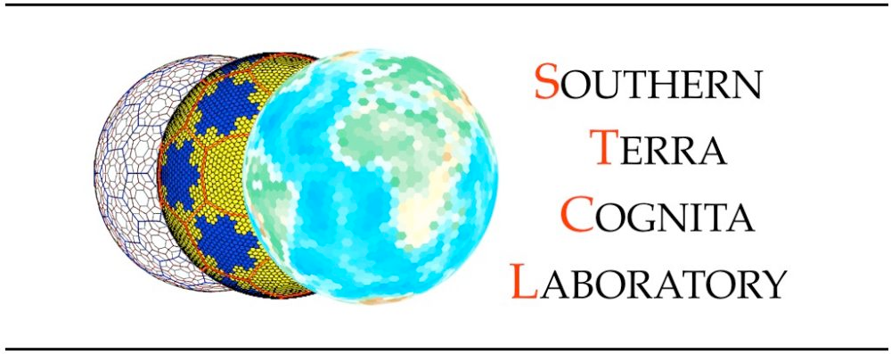
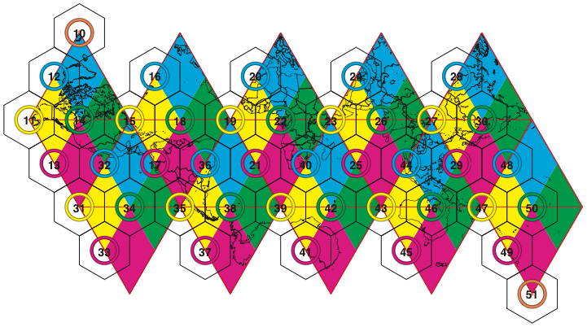
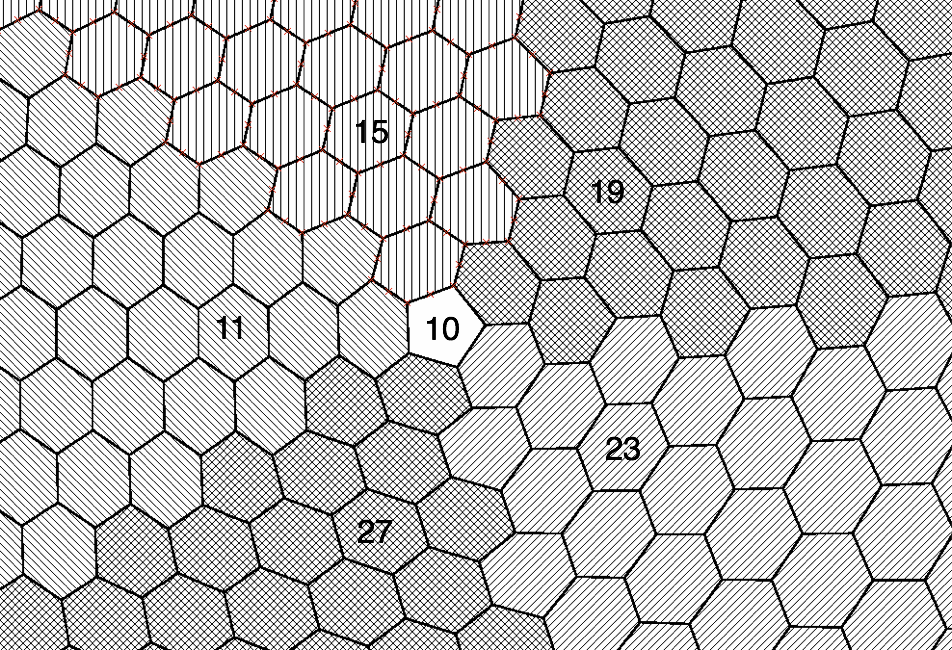
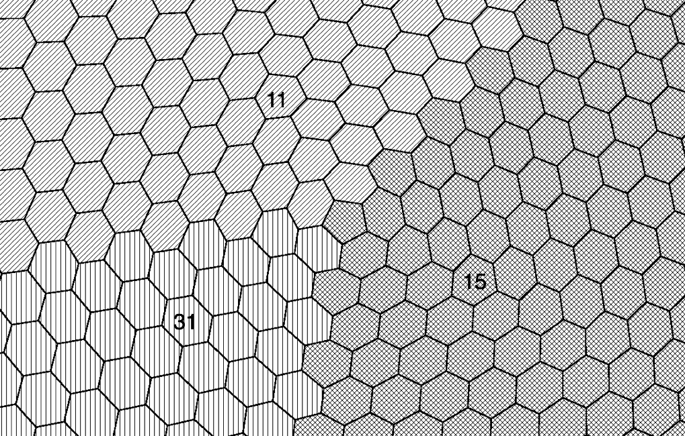
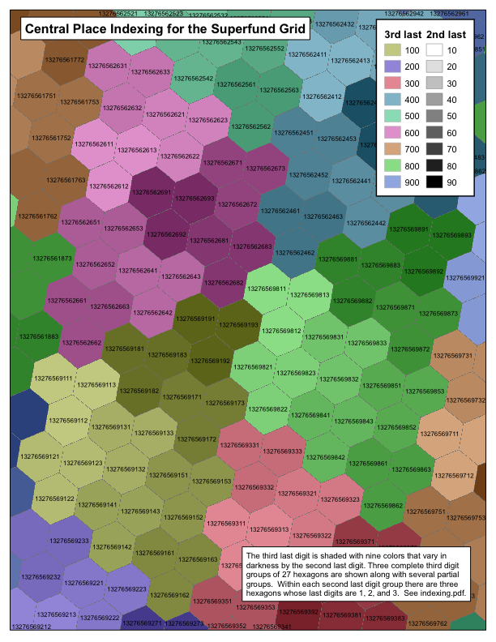
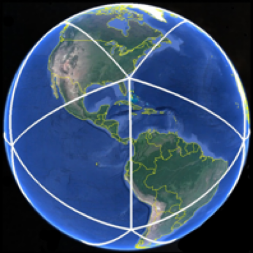
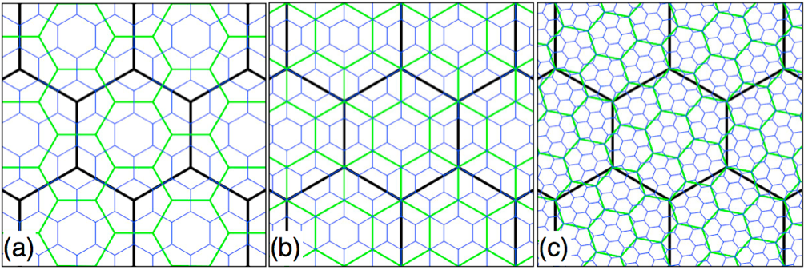
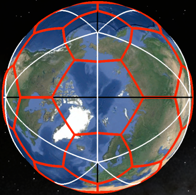
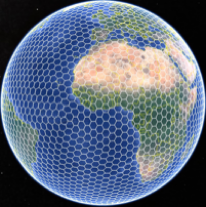

## DGGRID version 8.0b

### User Documentation for

### Discrete Global Grid Generation Software

## Kevin Sahr

## Terms of Use

This documentation is part of **DGGRID**.

**DGGRID** is free software: you can redistribute it and/or modify it
under the terms of the GNU Affero General Public License as published by
the Free Software Foundation, either version 3 of the License, or (at
your option) any later version.

**DGGRID** is distributed in the hope that it will be useful, but
WITHOUT ANY WARRANTY; without even the implied warranty of
MERCHANTABILITY or FITNESS FOR A PARTICULAR PURPOSE. See the GNU Affero
General Public License for more details.

You should have received a copy of the GNU Affero General Public License
along with the **DGGRID** source code. If not, see
\<https://www.gnu.org/licenses/\>.

**Credits**

**DGGRID** was primarily written in C++ by Kevin Sahr. See the file
**CHANGELOG.md** that comes with the source code for additional
contributors.

The original **DGGRID** specifications were developed by (in
alphabetical order): A. Ross Kiester, Tony Olsen, Barbara Rosenbaum,
Kevin Sahr, Ann Whelan, and Denis White.

**DGGRID** was made possible in part by funding from the **US
Environmental Protection Agency**, **PlanetRisk, Inc.**, **Culmen
International,** the **Ruhr-University Bochum/GeoInsight Project**,
**Turtle Conservancy**., and the **University of Tartu Landscape
Geoinformatics Lab**.

**DGGRID** can optionally make use of the following external library
(not included):

**•** The Open Source Geospatial Foundation’s GDAL translator library
for raster and vector geospatial data formats (see
[<u>gdal.org</u>](http://gdal.org))

**DGGRID** uses the following third-party libraries (included with the
**DGGRID** source code):

**•** Angus Johnson’s Clipper library; see <http://www.angusj.com>.

**•** George Marsaglia’s multiply-with-carry
“Mother-of-all-RNGs” pseudo-random number
generation function.

The gnomonic projection code is adapted from Gerald Evenden’s PROJ.4 library

Frank Warmerdam’s Shapelib library

The github source code distribution contains instructions on building
**DGGRID**. The examples directory contains example **DGGRID** metafiles
(with associated input files).

**DGGRID** version 8.0b was released October 24, 2023

***www.discreteglobalgrids.org***

## Table of Contents

1. Introduction [2](#_Toc)

2\. Metafile Format [3](#_Toc1)

3\. General Parameters [4](#_Toc2)

4\. Specifying the DGG [5](#_Toc3)

5\. Specifying Per-Cell Grid Output [10](#_Toc4)

6\. Grid Generation: Whole Earth or Clipping Polygons [14](#_Toc5)

7\. Specifying Point File Input [17](#_Toc6)

8\. Grid Generation: Point Binning [18](#_Toc7)

9\. Binning Point Values [19](#_Toc8)

10\. Presence/Absence Binning. [21](#_Toc9)

11\. Performing Address Conversions [23](#_Toc10)

12\. Outputting Grid Statistics [24](#_Toc11)

Appendix A. DGGRID Metafile Parameters [25](#_Toc12)

Appendix B. Default Values for Preset DGG Types [34](#_Toc13)

Appendix C. DGG Address Forms [35](#_Toc14)

Appendix D. Statistics for Some Preset ISEA DGGs [36](#_Toc15)

Aperture 3: ISEA3H [37](#_Toc16)

Aperture 4: ISEA4H [38](#_Toc17)

PlanetRisk Grid [39](#_Toc18)

Mixed Aperture 4 and 3: ISEA43H [40](#_Toc19)

Notes [44](#_Toc20)

Appendix E. The EPA Superfund_500m DGGS [45](#_Toc21)

Appendix F. The PlanetRisk DGGS [51](#_Toc22)

Appendix G. References [56](#_Toc23)

1. Introduction

**DGGRID** is a command-line application designed to generate and
manipulate icosahedral discrete global grids (DGGs) \[Sahr et al.,
2003\]. A single execution of **DGGRID** can perform one of six distinct
operations:

**1.** *Grid Generation from clipping polygons*. Generate the cells of a
DGG, either covering the complete surface of the earth or covering only
a specific set of regions on the earth’s surface.

**2.** *Grid Generation from points*. Generate the cells of a DGG,
either covering the complete surface of the earth or covering only a
specific set of regions on the earth’s surface.

**3.** *Point Value Binning*. Bin a set of floating-point values
associated with point locations into the cells of a DGG, by assigning to
each DGG cell the arithmetic mean of the values which are contained in
that cell.

**4.** *Presence/Absence Binning*. Given a set of input files, each
containing point locations associated with a particular class,
**DGGRID** outputs, for each cell of a DGG, a vector indicating whether
or not each class is present in that cell.

**5.** *Address Conversion*. Transform a file of locations from one
address form (such as longitude/latitude) to another (such as DGG cell
indexes).

**6.** *Output Grid Statistics*. Output a table of grid characteristics
for the specified DGG.

**DGGRID** is designed to be run from the Unix command line. **DGGRID**
requires a single command line argument, the name of a “metafile,” which is a plain text file that describes
the actions that **DGGRID** is to perform in that run. Thus **DGGRID**
is executed by typing at the command line:

dggrid *metaFileName.meta*

The metafile consists of a series of key-value pairs that tell
**DGGRID** how to proceed. The format of this metafile is described in
the next section. The rest of the sections in this documentation give
more detail on setting up metafile parameters to control the execution
of **DGGRID**.

2. Metafile Format

Metafiles are text files in which each line is either a comment, a blank
line, or a key-value pair that designates the value of a parameter for
**DGGRID**. Blank lines are ignored by **DGGRID**. Lines beginning with
‘\#’ are comments and are
also ignored by **DGGRID**.

A parameter is specified by a single line of the form:

*parameterName value*

Parameter names are not case sensitive. A parameter can be of one of
five types. The five parameter types, with a description of their legal
values, are:

1\. **boolean**. Legal values are **TRUE** and **FALSE** (case
sensitive).

2\. **integer**. Any integer is a legal value.

3\. **double**. Any real number, specified in decimal form, is a legal
value.

4\. **string**. The remainder of the line following the parameter name
is interpreted as the value.

5\. **choice**. Legal values consist of one of a finite set of keywords
specific to that parameter. The values of choice parameters are not case
sensitive but by convention are usually written in all capital letters.

Some parameters are only used for specific operations or when specific
other parameter conditions prevail. All parameters have a default value
which is used if no value is specified. Detailed information on each
parameter is given in the following sections and in **Appendix A**.
Repeating a parameter specification within the same metafile over-writes
the previously specified value; the last value given for a particular
parameter will be used.

Note that a number of parameters from previous versions of **DGGRID**
are still active in the code but are not described in this
documentation; that is because those parameters have not been fully
integrated with the new features in this beta release. Those parameters
will be fully restored in a future release.

See the examples directory in the **DGGRID** source code distribution
for examples of **DGGRID** metafiles.

3. General Parameters

In this section we describe the parameters which are used by every run
of **DGGRID**.

As described in **Section 1**, each run of **DGGRID** consists of one of
five distinct modes of operation. The operation is specified using the
**choice** parameter dggrid_operation. The allowable values for this
parameter are:

GENERATE_GRID - perform grid generation from polygons (see **Sections
6**)

GENERATE_GRID_FROM_POINTS - perform grid generation from points (see
**Section** **8**)

BIN_POINT_VALS - perform point value binning (see **Section 9**)

BIN_POINT_PRESENCE - perform presence/absence binning (see **Section
10**)

TRANSFORM_POINTS - perform address conversion (see **Section 11**)

OUTPUT_STATS - output a table of grid characteristics (see **Section
12**)

All operation modes require the specification of a single DGG. The
parameters for specifying a DGG are described in **Section 4**.

The **integer** parameter precision specifies the number of digits to
the right of the decimal place **DGGRID** is to use when outputting
floating point numbers, including latitude/longitude values.

The parameters verbosity, pause_on_startup, and pause_before_exit exist
solely to support debugging and can be ignored by users. These
parameters are described below.

The **integer** parameter verbosity is used to control the amount of
debugging information which is printed by **DGGRID**. Valid values are
from 0 to 3. The default value, 0, gives minimal output, which includes
the value of all active parameter settings. It is not recommended that
you increase this value.

Setting either of the **boolean** parameters pause_on_startup and/or
pause_before_exit to TRUE causes **DGGRID** to pause execution either
immediately after loading parameters, or just before program
termination, respectively. The default value for both parameters is
FALSE.

4. Specifying the DGG

**Background**

As described in \[Sahr et al., 2003\], a DGG system can be specified by
a set of independent design choices. The first design choice is the
desired base polyhedron; **DGGRID** can generate DGGs that have an
icosahedron as their base polyhedron. The remaining primary design
choices are:

**1.** The orientation of the base polyhedron relative to the earth.

**2.** The hierarchical spatial partitioning method defined
symmetrically on a face (or set of faces) of the base polyhedron. This
usually includes specifying the cell topology and an *aperture*, which
determines the area ratio between cells at sequential resolutions.

**3.** The transformation between each face and the corresponding
spherical surface.

**4.** The resolution (or degree of recursive partitioning).

The current version of **DGGRID** supports DGGs that use either the
Icosahedral Snyder Equal Area (ISEA) projection \[Snyder, 1992\] or the
icosahedral projection of R. Buckminster Fuller \[1975\] (as developed
analytically by Robert Gray \[1995\] and John Crider \[2008\]).
**DGGRID** can generate grids with cells that are triangles, diamonds,
or hexagons. Grids with a triangle or diamond topology must use an
aperture of 4, while hexagon grids can use an aperture of 3, 4, 7, or an
arbitrary mixed sequence of those apertures. **DGGRID** also supports
specifically designed “preset” DGGs, including the mixed aperture
hexagonal grids the US EPA **Superfund_500m** DGG (see **Appendix E**),
and the PlanetRisk DGG (see **Appendix F**).

Detailed information about the parameters that specify each of the DGG
design choices are given below, along with a discussion on specifying
the spherical earth radius.

**Preset DGG Types**

**DGGRID** provides a number of preset DGG types for your use. A preset
type can be chosen by specifying one of the following values for the
**choice** parameter dggs_type:

CUSTOM (default) - indicates that the grid parameters will be specified
manually (see below)

SUPERFUND - the **Superfund_500m** grid (see **Appendix E**)

PLANETRISK - the **PlanetRisk** grid (see **Appendix F**)

ISEA4T - ISEA projection with triangle cells and an aperture of 4

ISEA4D - ISEA projection with diamond cells and an aperture of 4

ISEA3H - ISEA projection with hexagon cells and an aperture of 3

ISEA4H - ISEA projection with hexagon cells and an aperture of 4

ISEA7H - ISEA projection with hexagon cells and an aperture of 7

ISEA43H - ISEA projection with hexagon cells and a mixed sequence of
aperture 4 resolutions followed by aperture 3 resolutions

FULLER4T - FULLER projection with triangle cells and an aperture of 4

FULLER4D - FULLER projection with diamond cells and an aperture of 4

FULLER3H - FULLER projection with hexagon cells and an aperture of 3

FULLER4H - FULLER projection with hexagon cells and an aperture of 4

FULLER7H - FULLER projection with hexagon cells and an aperture of 7

FULLER43H - FULLER projection with hexagon cells and a mixed sequence of
aperture 4 resolutions followed by aperture 3 resolutions

Each preset grid type sets appropriate values for all of the parameters
that specify a DGG. The default values for each preset grid type are
given in **Appendix B**. These default preset values can be overridden
by explicitly setting the desired individual parameters in your metafile
as described below. In particular, note that all preset grid types have
a default resolution; your desired DGG resolution should be specified
using the parameter dggs_res_spec (see below).

**Appendix D** gives some statistics on the individual resolutions of
the hexagonal ISEA preset DGGs.

**Manually Setting DGG Parameters**

The following parameters are used to describe a specific DGG instance.

**1. Specifying the orientation:** The orientation of a DGG base
icosahedron relative to the earth can be specified explicitly, randomly
determined, or set so that a specified point is maximally distant from
icosahedron vertices, by setting the **choice** parameter
dggs_orient_specify_type to SPECIFIED, RANDOM, or REGION_CENTER
respectively.

If dggs_orient_specify_type is set to SPECIFIED the DGG orientation is
determined by the location of a single icosahedron vertex and the
azimuth from that vertex to an adjacent vertex. The **double**
parameters dggs_vert0_lon and dggs_vert0_lat are used to specify the
location of the vertex, and the **double** parameter dggs_vert0_azimuth
to specify the azimuth to an adjacent vertex; all or these parameters
are in decimal degrees. Note that the default DGG placement, which is
symmetrical about the equator and has only a single icosahedron vertex
falling on land, is specified by:

dggs_vert0_lon 11.25

dggs_vert0_lat 58.28252559

dggs_vert0_azimuth 0.0

If dggs_orient_specify_type is set to RANDOM the orientation of the DGG
is randomly determined. All parameter values (including the randomly
generated values for a vertex location and azimuth used to orient the
grid) will be output for your information to the file specified by the
**string** parameter dggs_orient_output_file_name. Some control over the
random specification of the grid orientation is afforded by the
**choice** parameter rng_type and the **integer** parameter
dggs_orient_rand_seed. The **choice** parameter rng_type indicates which
pseudo-random number generator to use. A value of RAND indicates that
the C standard library rand/srand functions should be used. A value of
MOTHER (the default) indicates that George Marsaglia’s “Mother-of-all-RNGs” function
should be used. The seed value for **DGGRID** to use to initialize the
pseudo-random number sequence can be set using the **integer** parameter
dggs_orient_rand_seed.

If the current operation involves only a small region on the earth’s surface it is often convenient to orient the grid so
that no icosahedron vertices occur in the region of interest. Such an
orientation can be specified by setting dggs_orient_specify_type to
REGION_CENTER and then specifying the center point of the region using
the **double** parameters region_center_lon and region_center_lat (both
in decimal degrees).

All operations require that at least one DGG be specified. A single DGG
may be used by setting the **integer** parameter dggs_num_placements to
1 (the default). Alternatively, you may perform the desired operation on
multiple DGGs by setting dggs_num_placements to the desired number. If
the grid orientation is randomly chosen, this will perform the desired
operation on multiple randomly oriented grids. The parameters for each
grid will be output to a separate file based on the value of
dggs_orient_output_file_name, with an additional suffix indicating the
grid number (0001 to 000*n* where *n* equals the value of
dggs_num_placements). This suffix will also be used to designate the
corresponding output files (as specified in the particular operation
being performed). Note that if dggs_orient_specify_type is set to any
value other than RANDOM all of the grids generated will have exactly the
same orientation.

**2. Specifying the hierarchical spatial partitioning method:** The
hierarchical partitioning method used to generate the DGG is specified
by choosing a grid topology and aperture (defined as the ratio of areas
between cells in a given DGG resolution and the next finer resolution).
The topology is specified using the **choice** parameter dggs_topology
with one of the values: HEXAGON (default), TRIANGLE, or DIAMOND.

**DGGRID** can create grids that are produced using a single aperture,
as well as hexagon grids produced using a mixed aperture of some number
of aperture 4 resolutions followed by aperture 3 resolutions, or hexagon
grids with an arbitrary mixed aperture sequence of resolutions. The type
of aperture sequence is specified using the **choice** parameter
dggs_aperture_type with a value, respectively, of either PURE (default),
MIXED43, or SEQUENCE.

If a PURE aperture type is specified then the desired aperture is
specified with the **integer** parameter dggs_aperture. The valid values
for aperture are dependent on the chosen topology. **DGGRID** can create
HEXAGON DGGs with an aperture of 3, 4, or 7, and DIAMOND and TRIANGLE
DGGs with an aperture of 4.

If a MIXED43 aperture type is specified then the parameter dggs_aperture
is ignored. Instead, the **integer** parameter dggs_num_aperture_4\_res
(default 0) specifies the number of resolutions which use aperture 4;
the remaining grid resolutions up to the desired grid resolution (see
the next subsection) are generated using aperture 3. Note that the
parameter dggs_num_aperture_4\_res is ignored unless dggs_aperture_type
is MIXED43. Only HEXAGON topology grids may use the MIXED43 aperture
type.

If a SEQUENCE aperture type is specified then the parameter
dggs_aperture is ignored. Instead, the aperture sequence for the DGGS
must be specified as a string of 3’s, 4’s, and/or 7’s in the **string**
parameter dggs_aperture_sequence (default “333333333333”).

**3. Specifying the projection:** The regular polygon boundaries and
points associated with DGG cells are initially created on the planar
faces of an icosahedron; they must then be inversely projected to the
sphere. The desired projection to use for this is specified by the
**choice** parameter dggs_proj. The valid values are ISEA, which
specifies the Icosahedral Snyder Equal Area projection \[Snyder, 1992\],
or FULLER, which specifies the icosahedral Dymaxion projection of R.
Buckminster Fuller \[1975\] (as developed analytically by Robert Gray
\[1995\] and John Crider \[2008\]). The ISEA projection creates equal
area cells on the sphere at the expense of relatively high shape
distortion, while the Fuller projection strikes a balance between area
and shape distortion. See Gregory et al. \[2008\] for a more detailed
discussion of these trade-offs.

**4. Specifying the resolution:** The desired DGG resolution can be
specified using one of three methods chosen using the **choice**
parameter dggs_res_specify_type with one of the following values:

SPECIFIED (default) - the desired resolution is explicitly specified by
setting the value of the integer parameter dggs_res_spec (default 9).

CELL_AREA - the desired resolution is set to the DGG resolution whose
average cell area is closest to the area specified by the **double**
parameter dggs_res_specify_area (in square kilometers).

INTERCELL_DISTANCE - the desired resolution is set to the DGG resolution
whose approximate intercell distance is closest to the distance
specified by the **double** parameter
dggs_res_specify_intercell_distance (in kilometers). Note that the
intercell distance calculation is performed on the plane, and therefore
is only useful as a relative measure. See **Appendix D** for empirically
derived intercell statistics for some of the hexagonal ISEA preset grid
types.

If CELL_AREA or INTERCELL_DISTANCE is specified, then the desired area
or intercell distance (as applicable) is rounded up or down to the
nearest grid resolution based on the value of the **boolean** parameter
dggs_res_specify_rnd_down; a value of TRUE indicates round down, a value
of FALSE indicates round up. The chosen resolution is always output by
**DGGRID** for your information. The calculation of cell areas and
intercell distances uses the value specified for the earth radius (see
**Subsection 5** below).

In general, **DGGRID** will attempt to generate grids up to a maximum
resolution of **35**. For grids with a dggs_aperture_type of SEQUENCE,
the maximum resolution **DGGRID** will attempt is determined by the
length of the value of the string parameter dggs_aperture_sequence. If
the dggs_type is specified to be SUPERFUND then the only supported value
for dggs_res_specify_type is SPECIFIED, and the maximum resolution is
**9**.

However, the maximum resolution which can actually be successfully
generated by **DGGRID** is a function of the specified grid topology,
projection, the size of data types on the machine on which **DGGRID** is
compiled and executed, and the location of the generated grid region
relative to the faces of the underlying icosahedron. When generating
very high resolution grids the user should be aware that, even if
**DGGRID** reports success, the indexes and output cell geometries
should be validated to make sure that they are not degenerate.

**5. Specifying the earth radius:** The **choice** parameter proj_datum
specifies a datum that **DGGRID** will use to determine the spherical
radius of the earth. The legal values for this parameter are given
below, along with the earth radius that they indicate:

> WGS84_AUTHALIC_SPHERE (default): 6371.007180918475 km
>
> WGS84_MEAN_SPHERE: 6371.0087714 km
>
> CUSTOM_SPHERE: the earth radius (in kilometers) will be read from the
> **double** parameter proj_datum_radius

Note that the earth radius is *not* used in the process of generating
grid geometries in geodetic coordinates; such generation is performed on
a unit sphere. The radius is only used in determining the grid
resolution (when dggs_res_specify_type is not SPECIFIED) and in
generating grid statistics in kilometers.

5. Specifying Per-Cell Grid
Output

Any run of **DGGRID** which produces a set of grid cells (**choice**
parameter dggrid_operation values GENERATE_GRID,
GENERATE_GRID_FROM_POINTS, TRANSFORM_POINTS, BIN_POINT_VALS, or
BIN_POINT_PRESENCE) can generate, for the specified cells, any of the
following: cell boundaries, center points, topological neighbors, and/or
spatial hierarchy children. Each type of data can be output to a
separate file, each with its own file format, or some or all of the data
for each cell can be combined in a single output file.

All DGG cell boundaries and center points output from **DGGRID** are
given in geodetic (longitude/latitude) coordinates in decimal degrees.

The **choice** parameters cell_output_type and point_output_type specify
the desired output file format for cell boundaries and cell points
respectively. Each of these parameters may have the following values:

> NONE - indicates that no output of that type will be performed
>
> AIGEN - indicates that the cell/point output should be in ARC/INFO
> Generate file format (see Section 5).
>
> SHAPEFILE - indicates that the cell/point output should be in ESRI
> Shapefile format
>
> KML - indicates that the cell/point output should be in KML (Google
> Earth) format
>
> GEOJSON - indicates that the cell/point output should be in GeoJSON
> format
>
> GDAL - indicates that the cell/point output should be a
> GDAL-compatible file format
>
> GDAL_COLLECTION - indicates that the cell/point geometry output should
> be combined with other cell information in a GDAL-compatible file
> format
>
> TEXT - indicates that text file output in an operation-specific format
> (point_output_type only)

Note that **DGGRID** must be built with GDAL in order to use the output
types GDAL or GDAL_COLLECTION.

A value of GDAL for parameter cell_output_type and/or point_output_type
requires that the type of GDAL-compatible vector file format (see
[<u>gdal.org</u>](http://gdal.org)) be specified as the value of the
**string** parameter cell_output_gdal_format and/or
point_output_gdal_format respectively. Note that under the current
implementation the GDAL SHAPEFILE format has trouble handling file names
that contain directory path information. In such a situation we suggest
that you use the SHAPEFILE output type instead (which does not make use
of GDAL).

The file name prefix to use for the boundary or point output file is
specified using the **string** parameter cell_output_file_name or
point_output_file_name respectively. **DGGRID** will add the appropriate
file suffix to the specified prefix name, depending on the chosen file
format.

DGG output files created by **DGGRID** can be quite large, depending on
the size of the region being generated and the resolution of the grid.
The generated cell boundaries and/or points can be output across
multiple files by setting the **integer** parameter
max_cells_per_output_file to the maximum number of cells to output to a
single file. Setting the parameter to 0 (the default) will cause
**DGGRID** to output all cells to a single file, no matter how large. If
max_cells_per_output_file is greater than 0, output files are
distinguished by appending a “\_1”, “\_2”, etc. to each output file name.

Since cell boundaries are only true regular polygons in the chosen
projection space it may be desirable to introduce additional points into
the cell edges to better preserve the boundary shape after inverse
projection to longitude/latitude coordinates. The number of additional
points to introduce into each edge is specified by the **integer**
parameter densification. A value of 0 (the default) indicates that no
densification should be performed.

By default, each longitude value is output in the range -180.0 to 180.0
degrees. When visualized using a 2D program, cells that straddle the
anti-meridian can appear to “wrap” across the image. The **choice**
parameter longitude_wrap_mode can be used to force the output vertex
longitudes of such cells to be entirely positive (value UNWRAP_EAST),
entirely negative (value UNWRAP_WEST), or to follow the default behavior
(the default value WRAP). Setting the **boolean** parameter
unwrap_points to TRUE (the default value) forces each output cell center
point to follow the associated cell when it is unwrapped, so that cells
and points will display together in a 2D program. Note that some
GDAL-output file formats (e.g., GDAL KML) clamp the longitude range to
-180.0 to 180.0 degrees; in those cases unwrapping will be effectively
(and silently) ignored.

A unique integer cell identifier is output along with each cell boundary
or point. The integer identifier type is specified using the **choice**
parameter output_cell_label_type, which can have one of four values:

GLOBAL_SEQUENCE (default when dggs_type is not SUPERFUND) - the
identifier is the appropriate value in a linear sequence 1 to *n*, where
*n* is the total number of cells in the whole earth DGG

ENUMERATION - the generated cells are numbered from 1 to *n*, where *n*
is the total number of cells generated

OUTPUT_ADDRESS_TYPE - the identifier is output in the form indicated by
the **choice** parameter output_address_type (see **Appendix C**).

SUPERFUND (preset default when dggs_type is SUPERFUND) - the identifier
is a condensed Superfund_500m index (see **Appendix D**). This value
must be (and can only be) used when dggs_type is SUPERFUND.

Note that DGGRID provides two ways to generate output in either ESRI
Shapefile format or KML:

**1.** Set cell_output_type and/or point_output_type to SHAPEFILE or
KML, or

**2.** Set cell_output_type and/or point_output_type to GDAL and
cell_output_gdal_format and/or point_output_gdal_format to SHAPEFILE or
KML

When output is to an ESRI Shapefile the cell identifier is stored in a
global_id field. The ESRI Shapefile format limits integer fields to
32-bit integer size, which is not sufficient for storing the identifiers
associated with high resolution DGGs. Therefore **DGGRID** creates the
Shapefile field **global_id** as a fixed width string with a width
specified by the **integer** parameter shapefile_id_field_length
(default 11).

The color and width of KML output cell boundaries can be controlled
using the **string** parameter kml_default_color (default ffffffff or
opaque white) and the **integer** parameter kml_default_width (default
4) respectively. KML color values are expressed in 8 digit hexadecimal
notation of the form *aabbggrr*, with two hexadecimal digits (00 to ff)
each for the alpha, blue, green, and red components.

In addition to outputting the boundaries and center points of the
selected cells, **DGGRID** can output the topological neighbors of each
of the cells; i.e., the DGG cells that are adjacent to/share an edge
with each cell. **DGGRID** currently only supports neighbors for hexagon
and diamond grids (not triangle grids). To output cell neighbors, set
the **choice** parameter neighbor_output_type to TEXT. Specify the name
of the output neighbors file in the **string** parameter
neighbor_output_file_name. For each selected cellID the output file will
contain a single line of the form:

cellID neighborID~1~ neighborID~2~ … neighborID~n~

with the neighborID’s for each cell listed in counter-clockwise order
about the central cellID cell.

**DGGRID** can also output the spatial children of the selected cells.
That is, for each of the selected cells, **DGGRID** will determine and
output the cells in the next finer resolution of the DGGS which
intersect or are contained within the selected cell. To output cell
spatial children, set the **choice** parameter children_output_type to
TEXT. Specify the name of the output children file in the **string**
parameter children_output_file_name. For each selected cellID the output
file will contain a single line of the form:

cellID childID~1~ childID~2~ … childID~n~

So far we have discussed outputting each type of cell data to a
different output file. One or more of the features associated with each
cell may be output together in a single file by specifying the output
type GDAL_COLLECTION for each such desired feature ( cell_output_type,
point_output_type, neighbor_output_type, and/or children_output_type).
The chosen features must include either the cell boundary, point, or
both. The output file format for this single collection file is
specified in the **string** parameter collection_output_gdal_format, as
described above for the parameters cell_output_gdal_format and
point_output_gdal_format. Note that some GDAL formats may not support
the output of neighbors or children. The file name prefix to use for
this collection file is specified using the **string** parameter
collection_output_file_name.

6. Grid Generation: Whole Earth
or Clipping Polygons

Specifying the value GENERATE_GRID for the **choice** parameter
dggrid_operation will tell **DGGRID** to create all, or some portion of,
the specified DGG (see the previous section). The **choice** parameter
clip_subset_type controls the amount of the grid that will be generated.
Setting the parameter clip_subset_type to WHOLE_EARTH will generate the
entire earth at the specified resolution.

A subset of WHOLE_EARTH sequential cell IDs can be generated by
specifying the first and last sequence numbers to generate by setting
the values of the **integer** parameters output_first_seqnum and
output_last_seqnum respectively.

**DGGRID** provides three methods for generating a subset of the
specified DGG. The portion of the grid to be generated can be specified
by:

> • one or more files containing clipping polygons that indicate the
> regions to be generated (clip_subset_type values AIGEN, SHAPEFILE, or
> GDAL)
>
> • one or more text files containing the cell sequence numbers of the
> grid cells to be generated (clip_subset_type value SEQNUMS)
>
> • the cell sequence numbers of one or more coarser resolution cells to
> use as clipping polygons to indicate the regions to be generated
> (clip_subset_type values COARSE_CELLS)

Each of these methods is discussed below. Note that **DGGRID** must be
built with GDAL to make use of GDAL file formats.

A DGG that covers a portion of the earth’s surface can be generated by
specifying one or more files containing the clipping polygons which
**DGGRID** will use to determine the portion of the grid to generate.
**DGGRID** supports three types of clipping files: ARC/INFO Generate
files, ESRI Shapefiles, and vector file formats readable by GDAL. To
specify a clipping file format, set the parameter clip_subset_type to
AIGEN, SHAPEFILE, or GDAL respectively.

If clip_subset_type is set to AIGEN, SHAPEFILE, or GDAL then the string
parameter clip_region_files should be set to a space-delimited list of
file names, in the specified format, containing polygons to use for
clipping. If clip_subset_type is GDAL then the files must be in a
GDAL-readable vector format (see [<u>gdal.org</u>](http://gdal.org)).
The polygons must be specified using geodetic (latitude/longitude)
coordinates. Limitations in **DGGRID** require that each clipping
polygon be no more than approximately 60° of great circle arc in extant
in any direction. The exact limitation is determined by the relationship
between each polygon and the underlying icosahedron; **DGGRID** will let
you know if a polygon is too large for the grid generation you are
attempting. In that event you must break the polygon into smaller
polygons before using it in a clipping file.

When clip_subset_type is set to GDAL **DGGRID** will correctly handle
holes in the clipping polygons if the **boolean** parameter
clip_using_holes is set to TRUE (the default value is FALSE). Cells that
intersect a polygon but are entirely contained in one of that polygon’s
holes will not be chosen. Note that **DGGRID** will interpret holes as
regular polygons in non-GDAL input files.

The polygon intersection library uses an integer grid, the coarseness of
this grid is determined by the parameter clipper_scale_factor. Clipping
with a low resolution grid can sometimes produce incorrect results; if
this occurs try increasing the value of clipper_scale_factor (the
default value is 1000000). But note that doing so may limit the extent
of the region that can be clipped.

Intersections between the clipping polygons and the DGG cells are
performed in the specified DGG projection space, with the great circle
arcs between adjacent vertices in the original clipping polygons
transformed into straight lines on the projection plane. If adjacent
vertices in the original clipping polygons are too far apart this may
result in an inaccurate representation of the region boundary in the
clipping space. This effect can be minimized by introducing additional
points into the great circle arcs before projection. Setting the double
parameter geodetic_densify to some arc length (in decimal degrees) will
cause **DGGRID** to introduce extra points into each edge arc so that no
two vertices are more than the specified distance apart. Setting
geodetic_densify to 0.0 (the default) indicates that no such
densification is to be performed.

Alternately, in hexagon (only) grids the clipping regions to be
generated can be the cell boundaries of one or more cells in some
coarser resolution of the current multi-resolution DGGS (see **Section
4**). This is indicated by setting the parameter clip_subset_type to
COARSE_CELLS. The **integer** parameter clip_cell_res must be set to the
desired coarser resolution. The resolution must be less than the
resolution of the cells being generated (as specified in **Section 4**),
and must be greater than zero (because resolution 0 cells do not meet
the clipping polygon intersection algorithm requirements, as described
above). One or more cell sequence numbers from this coarser resolution
grid must be specified, space delimited, in the parameter
clip_cell_seqnums. The boundaries of these cells are then used as the
input clipping polygons, as described above, including possible edge
densification based on the value of parameter geodetic_densify. Because
that approach to densification can result in an unnecessary number of
vertexes and impact performance, we recommend instead using the
**integer** parameter clip_cell_densification, which specifies a number
of additional points to introduce into each cell edge prior to
projection. We recommend using a value of 1 (the default) for very
coarse resolutions to avoid anomalous results. A value of 0 indicates
that no densification of these coarse clipping cells should be
performed.

The cells for a given set of cell sequence numbers can be generated by
setting the parameter clip_subset_type to SEQNUMS (this is not supported
for grids with a dggs_aperture_type of SEQUENCE). Then clip_region_files
must be set to one or more text files containing the list of cell
sequence numbers to be generated. A single cell will be generated at
most once; duplicate sequence numbers in the input will be ignored.

Note that a single execution of **DGGRID** can take several hours (or
more!), depending on the resolution of the grid being generated and the
number and complexity of the clipping polygons (we recommend reducing
the number of vertices in clipping polygons whenever possible). You can
control the frequency of feedback during grid generation by setting the
integer parameter update_frequency. The value of this parameter
specifies the number of cells that will be tested for inclusion before
outputting a status update. The default value is 100000.

The per-cell output for the generated cells can be specified as
described in Section 5. In addition, the parameter point_output_type has
an additional value TEXT which will output the cell points,
one-per-line, formatted as:

*cellID*,*longitude*,*latitude*

7. Specifying Point File Input

The **choice** parameter dggrid_operation values
GENERATE_GRID_FROM_POINTS, BIN_POINT_VALS, TRANSFORM_POINTS, and
BIN_POINT_PRESENCE specify operations that take input from files
containing point locations. The input file format is specified by the
**choice** parameter point_input_file_type, which can have a value of
TEXT or GDAL (assuming **DGGRID** was built with the GDAL library).

The specific format for TEXT file input for each operation is described
in the **Section** for that operation. The values in a TEXT file must be
delimited by the character indicated within double quotes in the string
parameter input_delimiter.

The operation TRANSFORM_POINTS currently only takes TEXT input; GDAL
input files can not be used with that operation.

A single input file can be specified using the **string** parameter
input_file_name. Multiple input files can be specified by setting the
**string** parameter input_files to a space-delimited list of file
names, in the specified format, containing points to use as input. If
point_input_file_type is GDAL then the input file(s) must be in a
GDAL-readable vector format (see [<u>gdal.org</u>](http://gdal.org)).
The points must be specified using geodetic (latitude/longitude)
coordinates.

If the input locations cover a substantial portion of the earth’s surface, then the choice parameter bin_coverage
should be set to GLOBAL. If the locations covers only a relatively small
portion of the earth’s surface then bin_coverage
should be set to PARTIAL. This allows **DGGRID** to make trade-offs
between speed and memory usage. GLOBAL location sets are processed more
quickly, but may fail at higher DGG resolutions due to memory
restrictions. PARTIAL location sets are processed more slowly, but can
enable the use of higher resolution DGGs (depending on the actual extent
of the input locations).

8. Grid Generation: Point Binning

Specifying the value GENERATE_GRID_FROM_POINTS for the **choice**
parameter dggrid_operation will tell **DGGRID** to generate the cells of
the specified DGG (see **Section 4**) that contain one or more of the
points contained in the input files (specified as described in **Section
7**).

If the **boolean** parameter output_count is set to TRUE (the default is
FALSE), for each output cell the number of input points that are
contained in that cell is output in the cell field with the field name
specified in the **string** parameter output_count_field_name (default
value “count”).

9. Binning Point Values

Setting the choice parameter dggrid_operation to BIN_POINT_VALS tells
**DGGRID** to bin a set of floating-point data values associated with
geodetic coordinates into the cells of a DGG(s) specified as per
**Section 4**. The binning is performed by assigning to each DGG cell
the arithmetic mean of the values associated with the input points that
are contained in that cell. The input file(s) containing the points to
be binned are specified as described in **Section 7**.

If the input files are in GDAL format (**choice** parameter
point_input_file_type has value GDAL), then the value for each input
point is taken from the field named as specified in the **string**
parameter input_value_field_name (default “value”).

If the input files are in TEXT format (**choice** parameter
point_input_file_type has value TEXT), then each line in each input file
should consist of a longitude, a latitude (both in decimal degrees), and
a single floating-point value. These three values must be delimited by
the character indicated within double quotes in the string parameter
input_delimiter.

If the **boolean** parameter output_mean is set to TRUE (the default),
for each output cell the arithmetic mean of the values associated with
all input points that are contained in that cell is output in the cell
field with the field name specified in the **string** parameter
output_mean_field_name (default value “mean”).

If the **boolean** parameter output_count is set to TRUE (the default is
FALSE), for each output cell the number of input points that are
contained in that cell is output in a cell field with the field name
specified in the **string** parameter output_count_field_name (default
value “count”).

If the **boolean** parameter output_total is set to TRUE (the default is
FALSE), for each output cell the total summation of the values
associated with all input points that are contained in that cell is
output in a cell field with the field name specified in the **string**
parameter output_total_field_name (default value “total”).

In addition to the standard per-cell output described in **Section 5**,
**DGGRID** can output the cells in a text file format by setting the
choice parameter output_file_type to TEXT (the default for this
operation; set to NONE for no text output), and the **string** parameter
output_file_name (default “valsout.txt”) to the desired text output file
name. **DGGRID** will output the cell address and associated values for
each cell, one cell per line, into the text file. The cell addresses are
output in the form indicated by the **choice** parameter
output_address_type (see **Appendix C**), using the character specified
by parameter output_delimiter to separate any address components and to
separate the address from the associated value.

By setting the choice parameter cell_output_control you can limit
**DGGRID** to only output those cells which contain values
(OUTPUT_OCCUPIED), or you can tell **DGGRID** to output all cells
(OUTPUT_ALL), in which case cells in which no values occurred will be
output with a value of 0.0.

10. Presence/Absence Binning.

Setting the choice parameter dggrid_operation to BIN_POINT_PRESENCE
tells **DGGRID** to perform presence/absence binning into the DGG(s)
specified as per **Section 4**.

The input to this operation is a set of files (specified as described in
**Section 7**), with each file containing a set of locations associated
with one specific class of objects. If the input files are in TEXT
format (**choice** parameter point_input_file_type has value TEXT), then
each line in each input file should consist of a longitude and a
latitude (both in decimal degrees), separated by the character indicated
within double quotes in the **string** parameter input_delimiter. Each
location can be followed, on the same line, by arbitrary text which is
ignored by **DGGRID**; this arbitrary text must also be separated from
the latitude/longitude address by the same input delimiter character.

**DGGRID** determines which classes occur in which cells in the
specified DGG(s). The result for each cell is specified as a
presence/absence vector, which is a string of 0’s
and 1’s. The length of the string corresponds to
the number of input files (and therefore to the number of classes). Each
character in the string indicates whether the corresponding class is
present (indicated by a 1) or not present (indicated by a 0) in that
cell. The first character in the string corresponds to the class
represented by the first file listed in input_files, the second
character corresponds to the second file listed in input_files, and so
forth.

If the **boolean** parameter output_presence_vector is set to TRUE (the
default), for each output cell the calculated presence vector is output
in a cell field with the field name specified in the **string**
parameter output_presence_vector_field_name (default value “presVec”).

If the **boolean** parameter output_count is set to TRUE (the default is
FALSE), for each output cell the number of input points that are
contained in that cell is output in the cell field with the field name
specified in the **string** parameter output_count_field_name (default
value “count”).

If the **boolean** parameter output_num_classes is set to TRUE (the
default is FALSE), for each output cell the number of classes that are
contained in that cell (i.e., the number of 1’s in the cell’s presence
vector) is output in the cell field with the field name specified in the
**string** parameter output_num_classes_name (default value “numClass”).

In addition to the standard per-cell output described in **Section 5**,
**DGGRID** can output the cells in a text file format by setting the
choice parameter output_file_type to TEXT (the default for this
operation; set to NONE for no text output), and the **string** parameter
output_file_name (default “valsout.txt”) to the desired text output file
name. **DGGRID** will output the cell address and associated values for
each cell, one cell per line, into the text file. The cell addresses are
output in the form indicated by the choice parameter output_address_type
(see **Appendix C**), using the character specified by parameter
output_delimiter to separate any address components and to separate the
address from the associated value.

By setting the choice parameter cell_output_control you can limit
**DGGRID** to only out-putting those cells which contain at least one
class of object (OUTPUT_OCCUPIED) or have **DGGRID** output all cells
(OUTPUT_ALL), in which case cells containing no input-specified
locations would have presence/absence vectors consisting entirely of
0’s.

11. Performing Address
Conversions

Setting the **choice** parameter dggrid_operation to TRANSFORM_POINTS
tells **DGGRID** to perform address conversion. The input file(s) are
specified as described in **Section 7**, except that this operation
currently supports only TEXT input.

Each line in each input file should consist of an address followed by
optional arbitrary text. The components of the address (if any) must be
delimited by the character indicated within double quotes in the
**string** parameter input_delimiter, and if there is text following the
address it must also be separated from the address by that character.
The address must be a valid address under the address form indicated in
the **choice** parameter input_address_type (see **Appendix C**).
Address types other than GEO are interpreted as addresses in a DGG
specified as per **Section 4**.

Each input address is transformed to an address of the form indicated by
the **choice** parameter output_address_type, and the resulting cells
are output. The transformed cell address is output in a field named
“name”.

In addition to the standard per-cell output described in **Section 5**,
**DGGRID** can output the cells in a text file format by setting the
choice parameter output_file_type to TEXT (the default for this
operation; set to NONE for no text output), and the **string** parameter
output_file_name (default “valsout.txt”) to the desired text output file
name. **DGGRID** will output each transformed address, one cell per
line, into the text file using the value of output_delimiter to separate
any address components. If there was additional text on the input line
following the address, then an output delimiter followed by that text is
appended to the output line.

The TRANSFORM_POINTS operation can be used to determine the DGG cells
that correspond to a set of input geodetic coordinates by using an
input_address_type of GEO and an output_address_type corresponding to
the desired DGG indexing (e.g., SEQNUM). Note that this may result in
the same cell being output more than once. Also note that **DGGRID**
cannot be used to transform between two different DGGs in a single run,
since only one DGG can be defined per run. However, this can be
accomplished in two steps by first using **DGGRID** to transform cell
addresses in the input DGG into GEO addresses, and then using a second
run of **DGGRID** to transform those GEO addresses into the desired
output DGG.

12. Outputting Grid Statistics

Specifying the value OUTPUT_STATS for the **choice** parameter
dggrid_operation causes **DGGRID** to output a table of grid
characteristics for the specified DGG (see **Section 4**). The output
table will consist of all grid resolutions from 0 up to and including
the specified DGG resolution. The values output for each resolution are
the number of cells, the average area of a hexagonal cell in square
kilometers, and the characteristic length scale (CLS). The CLS is the
diameter of a spherical cap of the same area as a hexagonal cell of the
specified resolution; this metric was suggested by Ralph Kahn. The
calculation of average cell area uses the specified earth radius (see
**Section 4.5**).

The **integer** parameter precision (default 7) specifies the number of
digits to the right of the decimal point to output for each floating
point value.

Appendix A. DGGRID Metafile
Parameters

<table>
<colgroup>
<col style="width: 22%" />
<col style="width: 16%" />
<col style="width: 16%" />
<col style="width: 14%" />
<col style="width: 12%" />
<col style="width: 17%" />
</colgroup>
<thead>
<tr class="header">
<th>
<strong>Parameter Name</strong>

<strong>(Type)</strong>
</th>
<th><strong>Description</strong></th>
<th><strong>Allowed Values (<em>v</em>)</strong></th>
<th><strong>Default</strong></th>
<th><strong>Notes</strong></th>
<th><strong>Used When</strong></th>
</tr>
</thead>
<tbody>
<tr class="odd">
<td>
bin_coverage

(<strong>choice</strong>)
</td>
<td>are values distributed over most of the globe or only a relatively
small portion?</td>
<td>
GLOBAL

PARTIAL
</td>
<td>GLOBAL</td>
<td>allows <strong>DGGRID</strong> to determine how to trade-off speed
vs. memory usage</td>
<td>dggrid_operation is GENERATE_GRID_FROM_POINT, BIN_POINT_VALS or
BIN_POINT_PRESENCE</td>
</tr>
<tr class="even">
<td>
cell_output_control

(<strong>choice</strong>)
</td>
<td>designates which cells to output</td>
<td>OUTPUT_ALL OUTPUT_OCCUPIED</td>
<td>OUTPUT_ALL</td>
<td>
OUTPUT_ALL - output all cells, even if no input values were
associated with them

OUTPUT_OCCUPIED - output only cells with associated input
values
</td>
<td>dggrid_operation is BIN_POINT_VALS or BIN_POINT_PRESENCE</td>
</tr>
<tr class="odd">
<td>
cell_output_file_name

(<strong>string</strong>)
</td>
<td>cell boundary output file name prefix</td>
<td>any</td>
<td>“cells”</td>
<td></td>
<td>cell_output_type is AIGEN, SHAPEFILE, or KML</td>
</tr>
<tr class="even">
<td>
cell_output_gdal_format

(<strong>string</strong>)
</td>
<td>cell boundary output file format</td>
<td>GDAL-compatible vector file format (see gdal.org)</td>
<td>GeoJSON</td>
<td></td>
<td>cell_output_type is GDAL</td>
</tr>
<tr class="odd">
<td>
cell_output_type

(<strong>choice</strong>)
</td>
<td>cell boundary output file format</td>
<td>
NONE

AIGEN

SHAPEFILE

KML

GEOJSON

GDAL

GDAL_COLLECTION
</td>
<td>AIGEN</td>
<td></td>
<td></td>
</tr>
<tr class="even">
<td>
children_output_type

(<strong>choice</strong>)
</td>
<td>output cell spatial children?</td>
<td>
NONE

TEXT

GDAL_COLLECTION
</td>
<td>NONE</td>
<td></td>
<td></td>
</tr>
<tr class="odd">
<td>
children_output_file_name

(<strong>string</strong>)
</td>
<td>spatial children output file name</td>
<td>any</td>
<td>“chd”</td>
<td></td>
<td>children_output_type is TEXT</td>
</tr>
<tr class="even">
<td>
clip_cell_res

(<strong>integer</strong>)
</td>
<td>resolution of clipping cells</td>
<td>
0 &lt; <em>v &lt; r</em>,

where <em>r</em> is the currently specified DGG resolution
</td>
<td>1</td>
<td></td>
<td>
dggrid_operation is GENERATE_GRID

and clip_subset_type is COARSE_CELLS
</td>
</tr>
<tr class="odd">
<td>
clip_cell_densification

(<strong>integer</strong>)
</td>
<td>number of points- per-edge densification for clipping cell
boundaries</td>
<td>0 ≤ <em>v</em> ≤ 500</td>
<td>1</td>
<td><em>v</em> of 0 indicates no densification</td>
<td>
dggrid_operation is GENERATE_GRID

and clip_subset_type is COARSE_CELLS
</td>
</tr>
<tr class="even">
<td>
clip_cell_seqnums

(<strong>string</strong>)
</td>
<td>sequence number(s) of coarse clipping cells</td>
<td><em>seqNum1 seqNum2 ... seqNumN</em></td>
<td></td>
<td>cell resolution given by clip_cell_res</td>
<td>
dggrid_operation is GENERATE_GRID

and clip_subset_type is COARSE_CELLS
</td>
</tr>
<tr class="odd">
<td>
clip_region_files

(<strong>string</strong>)
</td>
<td>space delimited list of files that specify grid clipping</td>
<td>any</td>
<td>“test.gen”</td>
<td></td>
<td>dggrid_operation is GENERATE_GRID</td>
</tr>
<tr class="even">
<td>
clip_subset_type

(<strong>choice</strong>)
</td>
<td>specifies how portion of DGG to generate will be determined</td>
<td>
WHOLE_EARTH

AIGEN

SHAPEFILE

GDAL

SEQNUMS

COARSE_CELLS
</td>
<td>WHOLE_EARTH</td>
<td></td>
<td>
dggrid_operation is GENERATE_GRID; SEQNUMS is not supported if
dggs_aperture_type is SEQUENCE;

COARSE_CELLS is only supported for hexagon grids
</td>
</tr>
<tr class="odd">
<td>
clip_type

(<strong>choice</strong>)
</td>
<td>method for determining whether a cell is included by a clipping
polygon</td>
<td>POLY_INTERSECT</td>
<td>POLY_INTERSECT</td>
<td></td>
<td>dggrid_operation is GENERATE_GRID</td>
</tr>
<tr class="even">
<td>
clipper_scale_factor

(<strong>integer</strong>)
</td>
<td>number of cell inclusion tests to perform between outputting status
updates</td>
<td>1 ≤ <em>v</em></td>
<td>1000000</td>
<td></td>
<td>dggrid_operation is GENERATE_GRID</td>
</tr>
<tr class="odd">
<td>
clip_using_holes

(<strong>boolean</strong>)
</td>
<td>handle holes in input polygons?</td>
<td>
TRUE

FALSE
</td>
<td>0</td>
<td></td>
<td>
dggrid_operation is GENERATE_GRID;

clip_subset_type is GDAL
</td>
</tr>
<tr class="even">
<td>
collection_output_file_name

(<strong>string</strong>)
</td>
<td>collection output file name prefix</td>
<td>any</td>
<td>“cells”</td>
<td>see the last paragraph of <strong>Section 6</strong></td>
<td></td>
</tr>
<tr class="odd">
<td>
collection_output_gdal_format

(<strong>string</strong>)
</td>
<td>collection output file format</td>
<td>GDAL-compatible vector file format (see gdal.org)</td>
<td>GeoJSON</td>
<td>see the last paragraph of <strong>Section 6</strong></td>
<td></td>
</tr>
<tr class="even">
<td>
densification

(<strong>integer</strong>)
</td>
<td>number of points- per-edge densification to use when generating cell
boundaries</td>
<td>0 ≤ <em>v</em> ≤ 500</td>
<td>0</td>
<td><em>v</em> of 0 indicates no densification</td>
<td></td>
</tr>
<tr class="odd">
<td>
dggrid_operation

(<strong>choice</strong>)
</td>
<td>specifies the operation to be performed by this run of
<strong>DGGRID</strong></td>
<td>
GENERATE_GRID

BIN_POINT_VALS BIN_POINT_PRESENCE TRANSFORM_POINTS

OUTPUT_STATS
</td>
<td>GENERATE_GRID</td>
<td></td>
<td>always</td>
</tr>
<tr class="even">
<td>
dggs_aperture

(<strong>integer</strong>)
</td>
<td>desired DGGS aperture</td>
<td>3, 4, 7</td>
<td>4</td>
<td></td>
<td>dggs_aperture_type is PURE</td>
</tr>
<tr class="odd">
<td>
dggs_aperture_sequence

(<strong>string</strong>)
</td>
<td>the DGGS aperture sequence</td>
<td>string of 3’s, 4’s,
and 7’s in any order</td>
<td>"333333333333"</td>
<td></td>
<td>dggs_aperture_type is SEQUENCE</td>
</tr>
<tr class="even">
<td>
dggs_aperture_type

(<strong>choice</strong>)
</td>
<td>is the aperture sequence pure or mixed?</td>
<td>
PURE

MIXED43

SEQUENCE
</td>
<td>PURE</td>
<td></td>
<td>dggs_topology is HEXAGON</td>
</tr>
<tr class="odd">
<td>
dggs_num_aperture_4_res

(<strong>integer</strong>)
</td>
<td>number of aperture 4 resolutions in a mixed aperture sequence</td>
<td>0 ≤ <em>v</em> ≤ 35</td>
<td>0</td>
<td></td>
<td>dggs_aperture_type is MIXED43</td>
</tr>
<tr class="even">
<td>
dggs_num_placements

(<strong>integer</strong>)
</td>
<td>number of grid placements to use</td>
<td>1 ≤ <em>v</em></td>
<td>1</td>
<td>
if dggs_orient_

specify_type is not RANDOM all placements will be the same
</td>
<td></td>
</tr>
<tr class="odd">
<td>
dggs_orient_output_

file_name

(<strong>string</strong>)
</td>
<td>name of file for output of multiple DGGS placement parameter
values</td>
<td>any</td>
<td>“grid.meta”</td>
<td></td>
<td>dggs_num_placements &gt; 1</td>
</tr>
<tr class="even">
<td>
dggs_orient_rand_seed

(<strong>integer</strong>)
</td>
<td>seed for orientation random number generator</td>
<td>0 ≤ <em>v</em></td>
<td>77316727</td>
<td></td>
<td>dggs_orient_specify_type is RANDOM</td>
</tr>
<tr class="odd">
<td>
dggs_orient_specify_type

(<strong>choice</strong>)
</td>
<td>how is the DGG orientation specified?</td>
<td>
RANDOM

SPECIFIED REGION_CENTER
</td>
<td>SPECIFIED</td>
<td></td>
<td></td>
</tr>
<tr class="even">
<td>
dggs_proj

(<strong>choice</strong>)
</td>
<td>projection used by the DGGS</td>
<td>
ISEA

FULLER
</td>
<td>ISEA</td>
<td></td>
<td></td>
</tr>
<tr class="odd">
<td>
dggs_res_spec

(<strong>integer</strong>)
</td>
<td>specified DGG resolution</td>
<td>0 ≤ <em>v</em> ≤ 35</td>
<td>9</td>
<td>
if dggs_type is SUPERFUND then

0 ≤ <em>v</em> ≤ 9;

if dggs_aperture_type is SEQUENCE then 0 ≤ <em>v</em> ≤ <em>n</em>,
where <em>n</em> is the length of dggs_aperture_sequence)
</td>
<td>
dggs_res_specify_

type is SPECIFIED
</td>
</tr>
<tr class="even">
<td>
dggs_res_specify_area

(<strong>double</strong>)
</td>
<td>desired cell area</td>
<td>1.0 ≤ <em>v</em></td>
<td>100</td>
<td></td>
<td>
dggs_res_specify_

type is CELL_AREA
</td>
</tr>
<tr class="odd">
<td>
dggs_res_specify_

intercell_distance

(<strong>double</strong>)
</td>
<td>desired intercell distance (measured on the plane)</td>
<td>1.0 ≤ <em>v</em></td>
<td>100</td>
<td></td>
<td>
dggs_res_specify_

type is INTERCELL_DISTANCE
</td>
</tr>
<tr class="even">
<td>
dggs_res_specify_

rnd_down

(<strong>boolean</strong>)
</td>
<td>should the desired cell area or intercell distance be rounded down
(or up) to the nearest DGGS resolution?</td>
<td>
TRUE

FALSE
</td>
<td>1</td>
<td></td>
<td>
dggs_res_specify_

type is CELL_AREA or

INTERCELL_DISTANCE
</td>
</tr>
<tr class="odd">
<td>
dggs_res_specify_type

(<strong>choice</strong>)
</td>
<td>how is the DGGS resolution specified?</td>
<td>
SPECIFIED

CELL_AREA

INTERCELL_DISTANCE
</td>
<td>SPECIFIED</td>
<td></td>
<td></td>
</tr>
<tr class="even">
<td>
dggs_topology

(<strong>choice</strong>)
</td>
<td>desired cell shape</td>
<td>
HEXAGON

TRIANGLE

DIAMOND
</td>
<td>HEXAGON</td>
<td></td>
<td></td>
</tr>
<tr class="odd">
<td>
dggs_type

(<strong>choice</strong>)
</td>
<td>specify a preset DGG type</td>
<td>
CUSTOM

SUPERFUND

PLANETRISK

ISEA3H

ISEA4H

ISEA7H

ISEA43H

ISEA4T

ISEA4D

FULLER3H

FULLER4H

FULLER7H

FULLER43H

FULLER4T

FULLER4D
</td>
<td>CUSTOM</td>
<td>see Appendix <strong>B</strong> for preset parameter value
details</td>
<td></td>
</tr>
<tr class="even">
<td>
dggs_vert0_azimuth

(<strong>double</strong>)
</td>
<td>azimuth from icosahedron vertex 0 to vertex 1 (degrees)</td>
<td>0.0 ≤ <em>v</em> ≤ 360.0</td>
<td>0</td>
<td></td>
<td>
dggs_orient_

specify_type is SPECIFIED
</td>
</tr>
<tr class="odd">
<td>
dggs_vert0_lat

(<strong>double</strong>)
</td>
<td>latitude of icosahedron vertex 0 (degrees)</td>
<td>-90.0 ≤ v ≤ 90.0</td>
<td>58,28252559</td>
<td></td>
<td>
dggs_orient_

specify_type is SPECIFIED
</td>
</tr>
<tr class="even">
<td>
dggs_vert0_lon

(<strong>double</strong>)
</td>
<td>longitude of icosahedron vertex 0 (degrees)</td>
<td>-180.0 ≤ <em>v</em> ≤ 180.0</td>
<td>11,25</td>
<td></td>
<td>
dggs_orient_

specify_type is SPECIFIED
</td>
</tr>
<tr class="odd">
<td>
geodetic_densify

(<strong>double</strong>)
</td>
<td>maximum degrees of arc for a clipping polygon line segment</td>
<td>0.0 ≤ <em>v</em> ≤ 360.0</td>
<td>0</td>
<td>0.0 indicates no densification</td>
<td>dggrid_operation is GENERATE_GRID</td>
</tr>
<tr class="even">
<td>
input_address_type

(<strong>choice</strong>)
</td>
<td>cell address form in input file(s)</td>
<td>
GEO

Q2DI

SEQNUM

Q2DD

PROJTRI

VERTEX2DD
</td>
<td>GEO</td>
<td>see <strong>Appendix C</strong></td>
<td>dggrid_operation is TRANSFORM_POINTS, SEQNUM is not allowed if
dggs_aperture_type is SEQUENCE</td>
</tr>
<tr class="odd">
<td>
input_delimiter

(<strong>string</strong>)
</td>
<td>character that delimits address components and additional data in
the input files</td>
<td><em>v</em> is any single character in double quotes</td>
<td>
““

(a single space)
</td>
<td></td>
<td>dggrid_operation is TRANSFORM_POINTS, BIN_POINT_VALS, or
BIN_POINT_PRESENCE</td>
</tr>
<tr class="even">
<td>
input_file_name

(<strong>string</strong>)
</td>
<td>name of file containing input addresses</td>
<td><em>fileName</em></td>
<td>valsin.txt</td>
<td></td>
<td>dggrid_operation is TRANSFORM_POINTS, BIN_POINT_VALS, or
BIN_POINT_PRESENCE</td>
</tr>
<tr class="odd">
<td>
input_files

(<strong>string</strong>)
</td>
<td>name(s) of files containing lon/lat locations with associated
values</td>
<td><em>fileName1 fileName2 ... fileNameN</em></td>
<td>vals.txt</td>
<td></td>
<td>dggrid_operation is GENERATE_GRID_FROM_POINTS TRANSFORM_POINTS,
BIN_POINT_VALS, or BIN_POINT_PRESENCE</td>
</tr>
<tr class="even">
<td>
input_value_field_name

(<strong>string</strong>)
</td>
<td>field name containing value to bin</td>
<td></td>
<td>value</td>
<td></td>
<td>dggrid_operation is BIN_POINT_VALS</td>
</tr>
<tr class="odd">
<td>
kml_default_color

(<strong>string</strong>)
</td>
<td>color of cell boundaries in KML output</td>
<td>any valid KML color</td>
<td>ffffffff</td>
<td></td>
<td>cell_output_type is KML</td>
</tr>
<tr class="even">
<td>
kml_default_width

(<strong>integer</strong>)
</td>
<td>width of cell boundaries in KML output</td>
<td>1 ≤ <em>v</em> ≤ 100</td>
<td>4</td>
<td></td>
<td>cell_output_type is KML</td>
</tr>
<tr class="odd">
<td>
kml_description

(<strong>string</strong>)
</td>
<td>description tag value in KML output file</td>
<td></td>
<td>Generated by DGGRID 6.3</td>
<td></td>
<td>cell_output_type is KML</td>
</tr>
<tr class="even">
<td>
kml_name

(<strong>string</strong>)
</td>
<td>name tag value in KML output file</td>
<td></td>
<td>the output file name</td>
<td></td>
<td>cell_output_type is KML</td>
</tr>
<tr class="odd">
<td>
longitude_wrap_mode

(<strong>choice</strong>)
</td>
<td>how handle vertex longitude for cells that straddle the
anti-meridian?</td>
<td>
WRAP

UNWRAP_EAST

UNWRAP_WEST
</td>
<td>WRAP</td>
<td></td>
<td></td>
</tr>
<tr class="even">
<td>
max_cells_per_output_file

(<strong>integer</strong>)
</td>
<td>maximum number of cells output to a single output file</td>
<td>0 ≤ <em>v</em></td>
<td>0</td>
<td>0 indicates no maximum</td>
<td></td>
</tr>
<tr class="odd">
<td>
neighbor_output_type

(<strong>choice</strong>)
</td>
<td>output cell neighbors?</td>
<td>
NONE

TEXT

GDAL_COLLECTION
</td>
<td>NONE</td>
<td>triangle grids not supported</td>
<td></td>
</tr>
<tr class="even">
<td>
neighbor_output_file_name

(<strong>string</strong>)
</td>
<td>neighbors output file name</td>
<td>any</td>
<td>“nbr”</td>
<td>triangle grids not supported</td>
<td>neighbor_output_type is TEXT</td>
</tr>
<tr class="odd">
<td>
output_address_type

(<strong>choice</strong>)
</td>
<td>address form to use in output</td>
<td>
GEO

Q2DI

SEQNUM

INTERLEAVE

PLANE

Q2DD

PROJTRI

VERTEX2DD

AIGEN
</td>
<td>SEQNUM</td>
<td>see <strong>Appendix C</strong></td>
<td>dggrid_operation is TRANSFORM_POINTS, BIN_POINT_VALS, or
BIN_POINT_PRESENCE</td>
</tr>
<tr class="even">
<td>
output_cell_label_type

(<strong>choice</strong>)
</td>
<td>output form for generated cell indexes</td>
<td>GLOBAL_SEQUENCE ENUMERATION SUPERFUND</td>
<td>GLOBAL_SEQUENCE</td>
<td></td>
<td></td>
</tr>
<tr class="odd">
<td>
output_count

(<strong>boolean</strong>)
</td>
<td>output the count of classes which are present between the cell
address and the presence vector</td>
<td>
TRUE

FALSE
</td>
<td>0</td>
<td></td>
<td>dggrid_operation is GENERATE_GRID_FROM_POINT, BIN_POINT_VALS or
BIN_POINT_PRESENCE</td>
</tr>
<tr class="even">
<td>
output_count_field_name

(<strong>string</strong>)
</td>
<td>field name containing count of contained points</td>
<td></td>
<td>count</td>
<td></td>
<td>dggrid_operation is GENERATE_GRID_FROM_POINTSBIN_POINT_VALS, or
BIN_POINT_PRESENCE</td>
</tr>
<tr class="odd">
<td>
output_delimiter

(<strong>string</strong>)
</td>
<td>character that delimits address components and additional data in
the output file</td>
<td><em>v</em> is any single character in double quotes</td>
<td>
““

(a single space)
</td>
<td></td>
<td>dggrid_operation is TRANSFORM_POINTS, BIN_POINT_VALS, or
BIN_POINT_PRESENCE</td>
</tr>
<tr class="even">
<td>
output_file_name

(<strong>string</strong>)
</td>
<td>name of file to use for output</td>
<td></td>
<td>valsout.txt</td>
<td></td>
<td>dggrid_operation is TRANSFORM_POINTS, BIN_POINT_VALS, or
BIN_POINT_PRESENCE</td>
</tr>
<tr class="odd">
<td>
output_file_type

(<strong>choice</strong>)
</td>
<td>operation-specific text output?</td>
<td>
NONE

TEXT
</td>
<td>TEXT</td>
<td></td>
<td>dggrid_operation is TRANSFORM_POINTS, BIN_POINT_VALS, or
BIN_POINT_PRESENCE</td>
</tr>
<tr class="even">
<td>
output_first_seqnum

(<strong>integer</strong>)
</td>
<td>begin generating with this cell ID</td>
<td>0 ≤ <em>v</em> ≤ MAX_INT</td>
<td>0</td>
<td></td>
<td>dggrid_operation is GENERATE_GRID and clip_subset_type is
WHOLE_EARTH</td>
</tr>
<tr class="odd">
<td>
output_last_seqnum

(<strong>integer</strong>)
</td>
<td>last cell ID to generate</td>
<td>0 ≤ <em>v</em> ≤ MAX_INT</td>
<td>MAX_INT</td>
<td></td>
<td>dggrid_operation is GENERATE_GRID and clip_subset_type is
WHOLE_EARTH</td>
</tr>
<tr class="even">
<td>
output_mean

(<strong>boolean</strong>)
</td>
<td>output the mean of contained point values?</td>
<td>
TRUE

FALSE
</td>
<td>1</td>
<td></td>
<td>dggrid_operation is BIN_POINT_VALS</td>
</tr>
<tr class="odd">
<td>
output_mean_field_name

(<strong>string</strong>)
</td>
<td>field name containing mean of contained point values</td>
<td></td>
<td>mean</td>
<td></td>
<td>dggrid_operation is BIN_POINT_VALS</td>
</tr>
<tr class="even">
<td>
output_num_classes

(<strong>boolean</strong>)
</td>
<td>output the number of classes present in cell?</td>
<td>
TRUE

FALSE
</td>
<td>0</td>
<td></td>
<td>dggrid_operation is BIN_POINT_PRESENCE</td>
</tr>
<tr class="odd">
<td>
output_num_classes_field_name

(<strong>string</strong>)
</td>
<td>field name containing the number of classes present in cell</td>
<td></td>
<td>numClass</td>
<td></td>
<td>dggrid_operation is BIN_POINT_PRESENCE</td>
</tr>
<tr class="even">
<td>
output_presence_vector

(<strong>boolean</strong>)
</td>
<td>output the cell presence vector?</td>
<td>
TRUE

FALSE
</td>
<td>1</td>
<td></td>
<td>dggrid_operation is BIN_POINT_PRESENCE</td>
</tr>
<tr class="odd">
<td>
output_presence_vector_field_name

(<strong>string</strong>)
</td>
<td>field name containing the cell presence vector</td>
<td></td>
<td>presVec</td>
<td></td>
<td>dggrid_operation is BIN_POINT_PRESENCE</td>
</tr>
<tr class="even">
<td>
output_total

(<strong>boolean</strong>)
</td>
<td>output the total of contained point values?</td>
<td>
TRUE

FALSE
</td>
<td>0</td>
<td></td>
<td>dggrid_operation is BIN_POINT_VALS</td>
</tr>
<tr class="odd">
<td>
output_total_field_name

(<strong>string</strong>)
</td>
<td>field name containing total of contained point values</td>
<td></td>
<td>total</td>
<td></td>
<td>dggrid_operation is BIN_POINT_VALS</td>
</tr>
<tr class="even">
<td>
pause_before_exit

(<strong>boolean</strong>)
</td>
<td>pause program execution before exiting</td>
<td>
TRUE

FALSE
</td>
<td>0</td>
<td></td>
<td></td>
</tr>
<tr class="odd">
<td>
pause_on_startup

(<strong>boolean</strong>)
</td>
<td>pause program execution at program start</td>
<td>
TRUE

FALSE
</td>
<td>0</td>
<td></td>
<td></td>
</tr>
<tr class="even">
<td>
point_input_file_type

(<strong>string</strong>)
</td>
<td>point input file type</td>
<td>
TEXT

GDAL
</td>
<td>TEXT</td>
<td></td>
<td>dggrid_operation is TRANSFORM_POINTS, BIN_POINT_VALS, or
BIN_POINT_PRESENCE</td>
</tr>
<tr class="odd">
<td>
point_output_file_name

(<strong>string</strong>)
</td>
<td>cell point output file name prefix</td>
<td>0</td>
<td>“centers”</td>
<td></td>
<td>point_output_type is AIGEN, SHAPEFILE, KML, or TEXT</td>
</tr>
<tr class="even">
<td>
point_output_gdal_format

(<strong>string</strong>)
</td>
<td>point output file format</td>
<td>GDAL-compatible vector file format (see gdal.org)</td>
<td>GeoJSON</td>
<td></td>
<td>point_output_type is GDAL</td>
</tr>
<tr class="odd">
<td>
point_output_type

(<strong>choice</strong>)
</td>
<td>cell point output file format</td>
<td>
NONE

AIGEN

KML

SHAPEFILE

TEXT

GEOJSON 
GDAL

GDAL_COLLECTION
</td>
<td>NONE</td>
<td></td>
<td></td>
</tr>
<tr class="even">
<td>
precision

(<strong>integer</strong>)
</td>
<td>number of digits to right of decimal point when outputting floating
point numbers</td>
<td>0 ≤ <em>v</em> ≤ 30</td>
<td>7</td>
<td></td>
<td></td>
</tr>
<tr class="odd">
<td>
proj_datum

(<strong>choice</strong>)
</td>
<td>desired earth radius datum</td>
<td>
WGS84_AUTHALIC_

SPHERE

WGS84_MEAN_SPHERE

CUSTOM_SPHERE
</td>
<td>
WGS84_AUTHALIC_

SPHERE
</td>
<td></td>
<td></td>
</tr>
<tr class="even">
<td>
proj_datum_radius

(<strong>double</strong>)
</td>
<td>desired earth radius</td>
<td>1.0 ≤ <em>v</em> ≤ 10,000.0</td>
<td>6371,00718091847</td>
<td></td>
<td>proj_datum is CUSTOM_SPHERE</td>
</tr>
<tr class="odd">
<td>
randpts_concatenate_

output

(<strong>boolean</strong>)
</td>
<td>put random points for multiple DGG placements in a single file?</td>
<td>
TRUE

FALSE
</td>
<td>1</td>
<td></td>
<td>randpts_output_type is AIGEN, KML, SHAPEFILE, or TEXT</td>
</tr>
<tr class="even">
<td>
randpts_num_per_cell

(<strong>integer</strong>)
</td>
<td>number of random points to generate per cell</td>
<td>0 ≤ <em>v</em></td>
<td>0</td>
<td></td>
<td>randpts_output_type is AIGEN, KML, SHAPEFILE, or TEXT</td>
</tr>
<tr class="odd">
<td>
randpts_output_file_name

(<strong>string</strong>)
</td>
<td>random points-in-cell output file name prefix</td>
<td>any</td>
<td>“randPts”</td>
<td></td>
<td>
randpts_output_type is AIGEN, KML, SHAPEFILE, or TEXT and
randpts_num_per_

cell &gt; 0
</td>
</tr>
<tr class="even">
<td>
randpts_output_type

(<strong>choice</strong>)
</td>
<td>random points-in-cell output file format</td>
<td>
NONE

AIGEN

KML

SHAPEFILE

TEXT

GEOJSON
</td>
<td>NONE</td>
<td></td>
<td></td>
</tr>
<tr class="odd">
<td>
randpts_seed

(<strong>integer</strong>)
</td>
<td>seed for cell points random number generator</td>
<td>0 ≤ <em>v</em></td>
<td>77316727</td>
<td></td>
<td>randpts_output_type is RANDOM</td>
</tr>
<tr class="even">
<td>
region_center_lat

(<strong>double</strong>)
</td>
<td>latitude of study region (degrees)</td>
<td>-90.0 ≤ <em>v</em> ≤ 90.0</td>
<td>0</td>
<td></td>
<td>
dggs_orient_

specify_type is REGION_CENTER
</td>
</tr>
<tr class="odd">
<td>
region_center_lon

(<strong>double</strong>)
</td>
<td>longitude of study region (degrees)</td>
<td>-180.0 ≤ <em>v</em> ≤ 180.0</td>
<td>0</td>
<td></td>
<td>
dggs_orient_

specify_type is REGION_CENTER
</td>
</tr>
<tr class="even">
<td>
rng_type

(<strong>choice</strong>)
</td>
<td>specifies the random number generator to use</td>
<td>
RAND

MOTHER
</td>
<td>RAND</td>
<td>RAND: C standard library rand MOTHER: George Marsaglia's multiply-
with-carry “Mother” function</td>
<td></td>
</tr>
<tr class="odd">
<td>
shapefile_id_field_length

(<strong>integer</strong>)
</td>
<td>number of digits in Shapefile output cell index strings</td>
<td>1 ≤ <em>v</em> ≤ 50</td>
<td>11</td>
<td></td>
<td>cell_output_type, point_output_type, or randpts_output_type is
SHAPEFILE</td>
</tr>
<tr class="even">
<td>
wrap_points

(<strong>boolean</strong>)
</td>
<td>output point longitudes using longitude_wrap_mode?</td>
<td>
TRUE

FALSE
</td>
<td>1</td>
<td></td>
<td></td>
</tr>
<tr class="odd">
<td>
update_frequency

(<strong>integer</strong>)
</td>
<td>number of cell inclusion tests to perform between outputting status
updates</td>
<td>0 ≤ <em>v</em></td>
<td>100000</td>
<td></td>
<td>dggrid_operation is GENERATE_GRID</td>
</tr>
<tr class="even">
<td>
verbosity

(<strong>integer</strong>)
</td>
<td>amount of debugging output to display</td>
<td>0 ≤ <em>v</em> ≤ 3</td>
<td>0</td>
<td></td>
<td></td>
</tr>
</tbody>
</table>

Appendix B. Default Values for
Preset DGG Types

A preset grid type can be specified using the choice parameter
dggs_type. All preset grid types share the following default parameter
values:

dggs_orient_specify_type: SPECIFIED

dggs_num_placements: 1

dggs_vert0_lon: 11.25

dggs_vert0_lat: 58.28252559

dggs_vert0_azimuth: 0.0

dggs_res_specify_type: SPECIFIED

The table below gives the values of other parameters that are set by
each preset DGG type. In addition to the listed parameters, the preset
type SUPERFUND also sets the value of the parameter
output_cell_label_type to SUPERFUND. Note that any preset parameter
value can be overridden by explicitly specifying a different value for
that parameter in the metafile anywhere after the dggs_type parameter
value has been specified.

<table>
<colgroup>
<col style="width: 15%" />
<col style="width: 11%" />
<col style="width: 9%" />
<col style="width: 7%" />
<col style="width: 12%" />
<col style="width: 9%" />
<col style="width: 12%" />
<col style="width: 22%" />
</colgroup>
<thead>
<tr class="header">
<th><strong>dggs_type</strong></th>
<th>
<strong>dggs_</strong>

<strong>topology</strong>
</th>
<th>
<strong>dggs_</strong>

<strong>proj</strong>
</th>
<th>
<strong>dggs_</strong>

<strong>res_</strong>

<strong>spec</strong>
</th>
<th>
<strong>dggs_</strong>

<strong>aperture_</strong>

<strong>type</strong>
</th>
<th>
<strong>dggs_</strong>

<strong>aperture</strong>
</th>
<th>
<strong>dggs_num_</strong>

<strong>aperture_</strong>

<strong>4_res</strong>
</th>
<th>
<strong>dggs_</strong>

<strong>aperture_</strong>

<strong>sequence</strong>
</th>
</tr>
</thead>
<tbody>
<tr class="odd">
<td><strong>CUSTOM</strong></td>
<td>HEXAGON</td>
<td>ISEA</td>
<td>9</td>
<td>PURE</td>
<td>4</td>
<td>N/A</td>
<td>N/A</td>
</tr>
<tr class="even">
<td><strong>SUPERFUND</strong></td>
<td>HEXAGON</td>
<td>FULLER</td>
<td>9</td>
<td>MIXED43</td>
<td>N/A</td>
<td>N/A</td>
<td>N/A</td>
</tr>
<tr class="odd">
<td><strong>PLANETRISK</strong></td>
<td>HEXAGON</td>
<td>ISEA</td>
<td>11</td>
<td>SEQUENCE</td>
<td>N/A</td>
<td>N/A</td>
<td>43334777777777777777777</td>
</tr>
<tr class="even">
<td><strong>ISEA3H</strong></td>
<td>HEXAGON</td>
<td>ISEA</td>
<td>9</td>
<td>PURE</td>
<td>3</td>
<td>N/A</td>
<td>N/A</td>
</tr>
<tr class="odd">
<td><strong>ISEA4H</strong></td>
<td>HEXAGON</td>
<td>ISEA</td>
<td>9</td>
<td>PURE</td>
<td>4</td>
<td>N/A</td>
<td>N/A</td>
</tr>
<tr class="even">
<td><strong>ISEA7H</strong></td>
<td>HEXAGON</td>
<td>ISEA</td>
<td>9</td>
<td>SEQUENCE</td>
<td>N/A</td>
<td>N/A</td>
<td><em>string of 35 7’s</em></td>
</tr>
<tr class="odd">
<td><strong>ISEA43H</strong></td>
<td>HEXAGON</td>
<td>ISEA</td>
<td>9</td>
<td>MIXED43</td>
<td>N/A</td>
<td>0</td>
<td>N/A</td>
</tr>
<tr class="even">
<td><strong>ISEA4T</strong></td>
<td>TRIANGLE</td>
<td>ISEA</td>
<td>9</td>
<td>PURE</td>
<td>4</td>
<td>N/A</td>
<td>N/A</td>
</tr>
<tr class="odd">
<td><strong>ISEA4D</strong></td>
<td>DIAMOND</td>
<td>ISEA</td>
<td>9</td>
<td>PURE</td>
<td>4</td>
<td>N/A</td>
<td>N/A</td>
</tr>
<tr class="even">
<td><strong>FULLER3H</strong></td>
<td>HEXAGON</td>
<td>FULLER</td>
<td>9</td>
<td>PURE</td>
<td>3</td>
<td>N/A</td>
<td>N/A</td>
</tr>
<tr class="odd">
<td><strong>FULLER4H</strong></td>
<td>HEXAGON</td>
<td>FULLER</td>
<td>9</td>
<td>PURE</td>
<td>4</td>
<td>N/A</td>
<td>N/A</td>
</tr>
<tr class="even">
<td><strong>FULLER7H</strong></td>
<td>HEXAGON</td>
<td>FULLER</td>
<td>9</td>
<td>SEQUENCE</td>
<td>N/A</td>
<td>N/A</td>
<td><em>string of 35 7’s</em></td>
</tr>
<tr class="odd">
<td><strong>FULLER43H</strong></td>
<td>HEXAGON</td>
<td>FULLER</td>
<td>9</td>
<td>MIXED43</td>
<td>N/A</td>
<td>0</td>
<td>N/A</td>
</tr>
<tr class="even">
<td><strong>FULLER4T</strong></td>
<td>TRIANGLE</td>
<td>FULLER</td>
<td>9</td>
<td>PURE</td>
<td>4</td>
<td>N/A</td>
<td>N/A</td>
</tr>
<tr class="odd">
<td><strong>FULLER4D</strong></td>
<td>DIAMOND</td>
<td>FULLER</td>
<td>9</td>
<td>PURE</td>
<td>4</td>
<td>N/A</td>
<td>N/A</td>
</tr>
</tbody>
</table>

Appendix C. DGG Address Forms

In **DGGRID** geographic coordinates are always expressed as:

*longitude latitude*

in decimal degrees. The parameters input_address_type and
output_address_type refer to this address form as GEO.

**DGGRID** supports a number of address forms for specifying a
particular cell in a DGG. These address forms are listed below according
to their designation in the input_address_type and output_address_type
parameters:

> Q2DI - quad number and (i, j) coordinates on that quad
>
> SEQNUM - linear address (1 to size-of-DGG)
>
> • not supported for parameter input_address_type if dggs_aperture_type
> is SEQUENCE
>
> INTERLEAVE - digit-interleaved form of Q2DI
>
> • only supported for parameter output_address_type; not supported for
> parameter input_address_type
>
> • only available for hexagonal aperture 3 and 4 grids (not supported
> for aperture 7)
>
> PLANE - (x, y) coordinates on unfolded ISEA plane
>
> • only supported for parameter output_address_type; not supported for
> parameter input_address_type
>
> Q2DD - quad number and (x, y) coordinates on that quad
>
> PROJTRI - triangle number and (x, y) coordinates within that triangle
> on the ISEA plane
>
> VERTEX2DD - vertex number, triangle number, and (x, y) coordinates on
> ISEA plane

Appendix D. Statistics for Some
Preset ISEA DGGs

This appendix gives a table of characteristics for some hexagonal DGGs
based on the ISEA projection that can be specified as preset DGG types
using **DGGRID** (by setting metafile parameter dggs_type as specified).

The internode spacing statistics given in these tables were calculated
empirically on a symmetrical subset of the grid cells at each
resolution. They will differ from the internode spacing values used by
**DGGRID**, which are calculated on the plane (and are therefore only
approximate).

All measurements assume a spherical earth with a radius of
6,371.007180918475 km (WGS84 authalic sphere radius).

For footnotes refer to the **Notes** section following all tables.

Aperture 3: ISEA3H

(dggs_type ISEA3H)

|         |                       |                          |                            |             |             |              |
|-----|--------------|---------------|-----------|----------|----------|---------|
| **res** | **Number of Cells\*** | **Hex Area\*\* (km^2^)** | **Internode Spacing (km)** |             |             |              |
|         |                       |                          | **min**                    | **max**     | **mean**    | **std.dev.** |
| **1**   | 32                    | 17 002 187,39080         | 4 156,18000                | 4 649,10000 | 4 320,49000 | 233,01400    |
| **2**   | 92                    | 5 667 395,79693          | 2 324,81000                | 2 692,72000 | 2 539,69000 | 139,33400    |
| **3**   | 272                   | 1 889 131,93231          | 1 363,56000                | 1 652,27000 | 1 480,02000 | 89,39030     |
| **4**   | 812                   | 629 710,64410            | 756,96100                  | 914,27200   | 855,41900   | 52,14810     |
| **5**   | 2 432                 | 209 903,54803            | 453,74800                  | 559,23900   | 494,95900   | 29,81910     |
| **6**   | 7 292                 | 69 967,84934             | 248,80400                  | 310,69300   | 285,65200   | 17,84470     |
| **7**   | 21 872                | 23 322,61645             | 151,22100                  | 187,55000   | 165,05800   | 9,98178      |
| **8**   | 65 612                | 7 774,20548              | 82,31100                   | 104,47000   | 95,26360    | 6,00035      |
| **9**   | 196 832               | 2 591,40183              | 50,40600                   | 63,00970    | 55,02260    | 3,33072      |
| **10**  | 590 492               | 863,80061                | 27,33230                   | 35,01970    | 31,75960    | 2,00618      |
| **11**  | 1 771 472             | 287,93354                | 16,80190                   | 21,09020    | 18,34100    | 1,11045      |
| **12**  | 5 314 412             | 95,97785                 | 9,09368                    | 11,70610    | 10,58710    | 0,66942      |
| **13**  | 15 943 232            | 31,99262                 | 5,60065                    | 7,04462     | 6,11367     | 0,37016      |
| **14**  | 47 829 692            | 10,66421                 | 3,02847                    | 3,90742     | 3,52911     | 0,22322      |
| **15**  | 143 489 072           | 3,55473                  | 1,86688                    | 2,35058     | 2,03789     | 0,12339      |
| **16**  | 430 467 212           | 1,18491                  | 1,00904                    | 1,30335     | 1,17638     | 0,07442      |
| **17**  | 1 291 401 632         | 0,39497                  | 0,62229                    | 0,78391     | 0,67930     | 0,04113      |
| **18**  | 3 874 204 892         | 0,13166                  | 0,33628                    | 0,43459     | 0,39213     | 0,02481      |
| **19**  | 11 622 614 672        | 0,04389                  | 0,20743                    | 0,26137     | 0,22643     | 0,01371      |
| **20**  | 34 867 844 012        | 0,01463                  | 0,11208                    | 0,14489     | 0,13071     | 0,00827      |

Aperture 4: ISEA4H

dggs_type ISEA4H

|         |                       |                          |                            |             |             |              |
|----|--------------|---------------|-----------|-----------|----------|---------|
| **res** | **Number of Cells\*** | **Hex Area\*\* (km^2^)** | **Internode Spacing (km)** |             |             |              |
|         |                       |                          | **min**                    | **max**     | **mean**    | **std.dev.** |
| **1**   | 42                    | 12 751 640,54310         | 3 526,83000                | 4 003,02000 | 3 764,92000 | 238,59500    |
| **2**   | 162                   | 3 187 910,13578          | 1 730,20000                | 2 017,48000 | 1 913,88000 | 116,98200    |
| **3**   | 642                   | 796 977,53394            | 853,05600                  | 1 024,99000 | 961,97800   | 58,98050     |
| **4**   | 2 562                 | 199 244,38349            | 422,25300                  | 520,74600   | 481,77100   | 29,93870     |
| **5**   | 10 242                | 49 811,09587             | 209,61200                  | 262,55900   | 241,04700   | 15,09590     |
| **6**   | 40 962                | 12 452,77397             | 104,30400                  | 131,99100   | 120,56000   | 7,58663      |
| **7**   | 163 842               | 3 113,19349              | 51,98740                   | 66,29560    | 60,28930    | 3,80352      |
| **8**   | 655 362               | 778,29837                | 25,94120                   | 33,24750    | 30,14700    | 1,90448      |
| **9**   | 2 621 442             | 194,57459                | 12,95380                   | 16,65580    | 15,07410    | 0,95293      |
| **10**  | 10 485 762            | 48,64365                 | 6,47162                    | 8,33821     | 7,53719     | 0,47664      |
| **11**  | 41 943 042            | 12,16091                 | 3,23413                    | 4,17238     | 3,76863     | 0,23837      |
| **12**  | 167 772 162           | 3,04023                  | 1,61654                    | 2,08723     | 1,88432     | 0,11919      |
| **13**  | 671 088 642           | 0,76006                  | 0,80810                    | 1,04394     | 0,94217     | 0,05960      |
| **14**  | 2 684 354 562         | 0,19001                  | 0,40400                    | 0,52208     | 0,47108     | 0,02980      |
| **15**  | 10 737 418 242        | 0,04750                  | 0,20198                    | 0,26107     | 0,23554     | 0,01490      |
| **16**  | 42 949 672 962        | 0,01188                  | 0,10099                    | 0,13055     | 0,11777     | 0,00745      |

PlanetRisk Grid

dggs_type PLANETRISK

See **Appendix F** for a complete description of this grid system. The
table below gives the first 12 resolutions, though higher resolutions
can be generated (subsequent resolutions are aperture 7).

|         |                       |                          |                            |             |             |              |
|----|-------------|--------------|-----------|------------|-----------|---------|
| **res** | **Number of Cells\*** | **Hex Area\*\* (km^2^)** | **Internode Spacing (km)** |             |             |              |
|         |                       |                          | **min**                    | **max**     | **mean**    | **std.dev.** |
| **1**   | 42                    | 12 751 646,90980         | 3 526,83000                | 4 003,02000 | 3 764,92000 | 238,59500    |
| **2**   | 122                   | 4 250 548,96990          | 2 050,27000                | 2 445,80000 | 2 210,50000 | 134,60200    |
| **3**   | 362                   | 1 416 849,65660          | 1 143,10000                | 1 360,38000 | 1 280,77000 | 76,55180     |
| **4**   | 1 082                 | 472 283,21890            | 680,80200                  | 835,86200   | 742,02700   | 44,62200     |
| **5**   | 4 322                 | 118 070,80470            | 340,28000                  | 420,15500   | 371,29600   | 22,39940     |
| **6**   | 30 242                | 16 867,25780             | 121,59600                  | 157,37000   | 140,30000   | 8,57040      |
| **7**   | 211 682               | 2 409,60830              | 48,60570                   | 60,77060    | 53,05750    | 3,21180      |
| **8**   | 1 481 762             | 344,22980                | 17,25790                   | 22,76130    | 20,05030    | 1,24840      |
| **9**   | 10 372 322            | 49,17570                 | 6,94370                    | 8,73130     | 7,57970     | 0,45890      |
| **10**  | 72 606 242            | 7,02510                  | 2,46090                    | 3,26340     | 2,86450     | 0,17890      |
| **11**  | 508 243 682           | 1,00360                  | 0,99190                    | 1,24940     | 1,08280     | 0,06560      |
| **12**  | 3 557 705 762         | 0,14340                  | 0,35140                    | 0,46670     | 0,40920     | 0,02560      |

Mixed Aperture 4 and 3: ISEA43H

dggs_type ISEA43H

Note that this table is sorted by increasing cell size. In an ISEA43H
grid the cell size is determined by the combination of values specified
in the metafile for parameters dggs_num_aperture_4\_res (the first
column below) and dggs_res_spec (the second column).

| **\# Ap 4** | **Res** | **Number of Cells\*** | **Hex Area\*\* (km^2^)** | **Internode Spacing (km)** |             |             |              |
|------|----|------------|-------------|----------|----------|----------|---------|
| **Res**     |         |                       |                          | **min**                    | **max**     | **mean**    | **std.dev.** |
| **1**       | **2**   | 122                   | 4 250 546,84770          | 2 050,27000                | 2 445,80000 | 2 210,50000 | 134,60200    |
| **1**       | **3**   | 362                   | 1 416 848,94923          | 1 143,10000                | 1 360,38000 | 1 280,77000 | 76,55180     |
| **2**       | **3**   | 482                   | 1 062 636,71193          | 1 021,81000                | 1 246,71000 | 1 111,74000 | 66,88040     |
| **1**       | **4**   | 1 082                 | 472 282,98308            | 680,80200                  | 835,86200   | 742,02700   | 44,62200     |
| **2**       | **4**   | 1 442                 | 354 212,23731            | 565,39700                  | 690,57000   | 642,04700   | 39,50560     |
| **3**       | **4**   | 1 922                 | 265 659,17798            | 510,49600                  | 628,59000   | 556,76100   | 33,52270     |
| **1**       | **5**   | 3 242                 | 157 427,66103            | 374,89400                  | 463,73500   | 428,31100   | 26,59520     |
| **2**       | **5**   | 4 322                 | 118 070,74577            | 340,28000                  | 420,15500   | 371,29600   | 22,39940     |
| **3**       | **5**   | 5 762                 | 88 553,05933             | 280,26400                  | 349,09400   | 321,32800   | 20,04290     |
| **4**       | **5**   | 7 682                 | 66 414,79450             | 255,19700                  | 315,51700   | 278,50600   | 16,82030     |
| **1**       | **6**   | 9 722                 | 52 475,88701             | 226,83800                  | 280,57700   | 247,56900   | 14,95740     |
| **2**       | **6**   | 12 962                | 39 356,91526             | 186,14700                  | 233,60700   | 214,27900   | 13,42690     |
| **3**       | **6**   | 17 282                | 29 517,68644             | 170,12500                  | 210,75100   | 185,68800   | 11,22680     |
| **4**       | **6**   | 23 042                | 22 138,26483             | 139,31500                  | 175,54900   | 160,73100   | 10,09490     |
| **1**       | **7**   | 29 162                | 17 491,96234             | 123,74300                  | 156,19900   | 142,87800   | 8,98060      |
| **5**       | **6**   | 30 722                | 16 603,69862             | 127,59200                  | 158,48900   | 139,27000   | 8,42455      |
| **2**       | **7**   | 38 882                | 13 118,97175             | 113,41500                  | 141,01800   | 123,79700   | 7,48970      |
| **3**       | **7**   | 51 842                | 9 839,22881              | 92,65450                   | 117,43200   | 107,16800   | 6,74663      |
| **4**       | **7**   | 69 122                | 7 379,42161              | 85,06050                   | 105,99400   | 92,84930    | 5,61894      |
| **1**       | **8**   | 87 482                | 5 830,65411              | 75,60920                   | 94,29160    | 82,53310    | 4,99505      |
| **5**       | **7**   | 92 162                | 5 534,56621              | 69,39600                   | 88,24730    | 80,38160    | 5,06634      |
| **2**       | **8**   | 116 642               | 4 372,99058              | 61,65500                   | 78,49940    | 71,45200    | 4,50532      |
| **6**       | **7**   | 122 882               | 4 150,92466              | 63,79510                   | 79,64280    | 69,63760    | 4,21501      |
| **3**       | **8**   | 155 522               | 3 279,74294              | 56,70670                   | 70,84140    | 61,90030    | 3,74689      |
| **4**       | **8**   | 207 362               | 2 459,80720              | 46,19200                   | 58,96580    | 53,59140    | 3,38187      |
| **1**       | **9**   | 262 442               | 1 943,55137              | 41,04410                   | 52,44340    | 47,63750    | 3,00696      |
| **5**       | **8**   | 276 482               | 1 844,85540              | 42,53000                   | 53,20880    | 46,42540    | 2,81045      |
| **2**       | **9**   | 349 922               | 1 457,66353              | 37,80440                   | 47,32180    | 41,26710    | 2,49825      |
| **6**       | **8**   | 368 642               | 1 383,64155              | 34,61350                   | 44,28150    | 40,19490    | 2,53804      |
| **3**       | **9**   | 466 562               | 1 093,24765              | 30,75780                   | 39,38000    | 35,72920    | 2,25652      |
| **7**       | **8**   | 491 522               | 1 037,73116              | 31,89750                   | 39,95570    | 34,81920    | 2,10797      |
| **4**       | **9**   | 622 082               | 819,93573                | 28,35330                   | 35,53200    | 30,95040    | 1,87379      |
| **1**       | **10**  | 787 322               | 647,85046                | 25,20290                   | 31,59700    | 27,51150    | 1,66561      |
| **5**       | **9**   | 829 442               | 614,95180                | 23,05280                   | 29,56480    | 26,79750    | 1,69313      |
| **2**       | **10**  | 1 049 762             | 485,88784                | 20,48640                   | 26,28940    | 23,82020    | 1,50522      |
| **6**       | **9**   | 1 105 922             | 461,21385                | 21,26500                   | 26,67450    | 23,21280    | 1,40539      |
| **3**       | **10**  | 1 399 682             | 364,41588                | 18,90220                   | 23,71890    | 20,63360    | 1,24924      |
| **7**       | **9**   | 1 474 562             | 345,91039                | 17,27980                   | 22,19230    | 20,09850    | 1,27026      |
| **4**       | **10**  | 1 866 242             | 273,31191                | 15,35680                   | 19,73240    | 17,86540    | 1,12925      |
| **8**       | **9**   | 1 966 082             | 259,43279                | 15,94870                   | 20,02190    | 17,40960    | 1,05406      |
| **1**       | **11**  | 2 361 962             | 215,95015                | 13,64790                   | 17,54480    | 15,88050    | 1,00387      |
| **5**       | **10**  | 2 488 322             | 204,98393                | 14,17660                   | 17,80240    | 15,47520    | 0,93695      |
| **2**       | **11**  | 3 149 282             | 161,96261                | 12,60150                   | 15,82860    | 13,75580    | 0,83285      |
| **6**       | **10**  | 3 317 762             | 153,73795                | 11,51260                   | 14,80890    | 13,39920    | 0,84712      |
| **3**       | **11**  | 4 199 042             | 121,47196                | 10,23190                   | 13,16650    | 11,91050    | 0,75305      |
| **7**       | **10**  | 4 423 682             | 115,30346                | 10,63250                   | 13,36000    | 11,60640    | 0,70272      |
| **4**       | **11**  | 5 598 722             | 91,10397                 | 9,45109                    | 11,87820    | 10,31680    | 0,62464      |
| **8**       | **10**  | 5 898 242             | 86,47760                 | 8,63138                    | 11,11270    | 10,04950    | 0,63545      |
| **1**       | **12**  | 7 085 882             | 71,98338                 | 8,40097                    | 10,56060    | 9,17051     | 0,55524      |
| **5**       | **11**  | 7 464 962             | 68,32798                 | 7,67135                    | 9,87982     | 8,93293     | 0,56487      |
| **9**       | **10**  | 7 864 322             | 64,85820                 | 7,97436                    | 10,02520    | 8,70482     | 0,52704      |
| **2**       | **12**  | 9 447 842             | 53,98754                 | 6,81818                    | 8,78363     | 7,94040     | 0,50213      |
| **6**       | **11**  | 9 953 282             | 51,24598                 | 7,08832                    | 8,91291     | 7,73762     | 0,46848      |
| **3**       | **12**  | 12 597 122            | 40,49065                 | 6,30073                    | 7,92394     | 6,87788     | 0,41643      |
| **7**       | **11**  | 13 271 042            | 38,43449                 | 5,75194                    | 7,41293     | 6,69974     | 0,42370      |
| **4**       | **12**  | 16 796 162            | 30,36799                 | 5,11234                    | 6,59024     | 5,95533     | 0,37664      |
| **8**       | **11**  | 17 694 722            | 28,82587                 | 5,31624                    | 6,68732     | 5,80321     | 0,35136      |
| **1**       | **13**  | 21 257 642            | 23,99446                 | 4,54389                    | 5,85880     | 5,29364     | 0,33480      |
| **5**       | **12**  | 22 394 882            | 22,77599                 | 4,72555                    | 5,94513     | 5,15841     | 0,31232      |
| **9**       | **11**  | 23 592 962            | 21,61940                 | 4,31298                    | 5,56160     | 5,02482     | 0,31780      |
| **2**       | **13**  | 28 343 522            | 17,99585                 | 4,20049                    | 5,28525     | 4,58526     | 0,27762      |
| **6**       | **12**  | 29 859 842            | 17,08199                 | 3,83345                    | 4,94425     | 4,46652     | 0,28250      |
| **10**      | **11**  | 31 457 282            | 16,21455                 | 3,98718                    | 5,01714     | 4,35241     | 0,26352      |
| **3**       | **13**  | 37 791 362            | 13,49688                 | 3,40726                    | 4,39539     | 3,97024     | 0,25112      |
| **7**       | **12**  | 39 813 122            | 12,81150                 | 3,54416                    | 4,46020     | 3,86881     | 0,23424      |
| **4**       | **13**  | 50 388 482            | 10,12266                 | 3,15036                    | 3,96505     | 3,43894     | 0,20822      |
| **8**       | **12**  | 53 084 162            | 9,60862                  | 2,87459                    | 3,70916     | 3,34990     | 0,21189      |
| **1**       | **14**  | 63 772 922            | 7,99815                  | 2,80032                    | 3,52485     | 3,05684     | 0,18508      |
| **5**       | **13**  | 67 184 642            | 7,59200                  | 2,55504                    | 3,29734     | 2,97769     | 0,18835      |
| **9**       | **12**  | 70 778 882            | 7,20647                  | 2,65812                    | 3,34599     | 2,90161     | 0,17568      |
| **2**       | **14**  | 85 030 562            | 5,99862                  | 2,27101                    | 2,93122     | 2,64684     | 0,16742      |
| **6**       | **13**  | 89 579 522            | 5,69400                  | 2,36277                    | 2,97448     | 2,57921     | 0,15616      |
| **10**      | **12**  | 94 371 842            | 5,40485                  | 2,15564                    | 2,78247     | 2,51243     | 0,15892      |
| **3**       | **14**  | 113 374 082           | 4,49896                  | 2,10024                    | 2,64420     | 2,29263     | 0,13881      |
| **7**       | **13**  | 119 439 362           | 4,27050                  | 1,91602                    | 2,47350     | 2,23327     | 0,14127      |
| **11**      | **12**  | 125 829 122           | 4,05364                  | 1,99359                    | 2,51002     | 2,17621     | 0,13176      |
| **4**       | **14**  | 151 165 442           | 3,37422                  | 1,70305                    | 2,19883     | 1,98513     | 0,12557      |
| **8**       | **13**  | 159 252 482           | 3,20287                  | 1,77208                    | 2,23129     | 1,93441     | 0,11712      |
| **1**       | **15**  | 191 318 762           | 2,66605                  | 1,51376                    | 1,95464     | 1,76456     | 0,11162      |
| **5**       | **14**  | 201 553 922           | 2,53067                  | 1,57518                    | 1,98351     | 1,71947     | 0,10411      |
| **9**       | **13**  | 212 336 642           | 2,40216                  | 1,43686                    | 1,85544     | 1,67496     | 0,10595      |
| **2**       | **15**  | 255 091 682           | 1,99954                  | 1,40016                    | 1,76323     | 1,52842     | 0,09254      |
| **6**       | **14**  | 268 738 562           | 1,89800                  | 1,27716                    | 1,64937     | 1,48885     | 0,09418      |
| **10**      | **13**  | 283 115 522           | 1,80162                  | 1,32906                    | 1,67373     | 1,45080     | 0,08784      |
| **3**       | **15**  | 340 122 242           | 1,49965                  | 1,13521                    | 1,46619     | 1,32342     | 0,08372      |
| **7**       | **14**  | 358 318 082           | 1,42350                  | 1,18139                    | 1,48785     | 1,28960     | 0,07808      |
| **11**      | **13**  | 377 487 362           | 1,35121                  | 1,07755                    | 1,39177     | 1,25622     | 0,07947      |
| **4**       | **15**  | 453 496 322           | 1,12474                  | 1,05012                    | 1,32260     | 1,14631     | 0,06941      |
| **8**       | **14**  | 477 757 442           | 1,06762                  | 0,95779                    | 1,23719     | 1,11664     | 0,07064      |
| **12**      | **13**  | 503 316 482           | 1,01341                  | 0,99679                    | 1,25547     | 1,08810     | 0,06588      |
| **1**       | **16**  | 573 956 282           | 0,88868                  | 0,93344                    | 1,17570     | 1,01895     | 0,06169      |
| **5**       | **15**  | 604 661 762           | 0,84356                  | 0,85134                    | 1,09977     | 0,99257     | 0,06279      |
| **9**       | **14**  | 637 009 922           | 0,80072                  | 0,88604                    | 1,11602     | 0,96720     | 0,05856      |
| **2**       | **16**  | 765 275 042           | 0,66651                  | 0,75673                    | 0,97762     | 0,88228     | 0,05581      |
| **6**       | **15**  | 806 215 682           | 0,63267                  | 0,78759                    | 0,99206     | 0,85974     | 0,05205      |
| **10**      | **14**  | 849 346 562           | 0,60054                  | 0,71829                    | 0,92799     | 0,83748     | 0,05298      |
| **3**       | **16**  | 1 020 366 722         | 0,49988                  | 0,70008                    | 0,88187     | 0,76421     | 0,04627      |
| **7**       | **15**  | 1 074 954 242         | 0,47450                  | 0,63847                    | 0,82491     | 0,74443     | 0,04709      |
| **11**      | **14**  | 1 132 462 082         | 0,45040                  | 0,66453                    | 0,83710     | 0,72540     | 0,04392      |
| **4**       | **16**  | 1 360 488 962         | 0,37491                  | 0,56751                    | 0,73328     | 0,66171     | 0,04186      |
| **8**       | **15**  | 1 433 272 322         | 0,35587                  | 0,59069                    | 0,74412     | 0,64480     | 0,03904      |
| **12**      | **14**  | 1 509 949 442         | 0,33780                  | 0,53869                    | 0,69605     | 0,62811     | 0,03973      |
| **1**       | **17**  | 1 721 868 842         | 0,29623                  | 0,50445                    | 0,65182     | 0,58819     | 0,03721      |
| **5**       | **16**  | 1 813 985 282         | 0,28119                  | 0,52506                    | 0,66146     | 0,57316     | 0,03470      |
| **9**       | **15**  | 1 911 029 762         | 0,26691                  | 0,47883                    | 0,61873     | 0,55832     | 0,03532      |
| **13**      | **14**  | 2 013 265 922         | 0,25335                  | 0,49840                    | 0,62788     | 0,54405     | 0,03294      |
| **2**       | **17**  | 2 295 825 122         | 0,22217                  | 0,46672                    | 0,58798     | 0,50947     | 0,03085      |
| **6**       | **16**  | 2 418 647 042         | 0,21089                  | 0,42562                    | 0,55000     | 0,49628     | 0,03140      |
| **10**      | **15**  | 2 548 039 682         | 0,20018                  | 0,44302                    | 0,55813     | 0,48360     | 0,02928      |
| **3**       | **17**  | 3 061 100 162         | 0,16663                  | 0,37832                    | 0,48890     | 0,44114     | 0,02791      |
| **7**       | **16**  | 3 224 862 722         | 0,15817                  | 0,39380                    | 0,49613     | 0,42987     | 0,02603      |
| **11**      | **15**  | 3 397 386 242         | 0,15013                  | 0,35910                    | 0,46408     | 0,41874     | 0,02649      |
| **4**       | **17**  | 4 081 466 882         | 0,12497                  | 0,35004                    | 0,44101     | 0,38210     | 0,02314      |
| **8**       | **16**  | 4 299 816 962         | 0,11862                  | 0,31920                    | 0,41252     | 0,37221     | 0,02355      |
| **12**      | **15**  | 4 529 848 322         | 0,11260                  | 0,33226                    | 0,41862     | 0,36270     | 0,02196      |
| **1**       | **18**  | 5 165 606 522         | 0,09874                  | 0,31115                    | 0,39202     | 0,33965     | 0,02056      |
| **5**       | **17**  | 5 441 955 842         | 0,09373                  | 0,28373                    | 0,36670     | 0,33086     | 0,02093      |
| **13**      | **15**  | 6 039 797 762         | 0,08445                  | 0,26932                    | 0,34808     | 0,31405     | 0,01987      |
| **2**       | **18**  | 6 887 475 362         | 0,07406                  | 0,25220                    | 0,32596     | 0,29409     | 0,01860      |

Notes

\* At every resolution 12 of the cells are pentagons and the remainder
are hexagons.

\*\* The 12 pentagons at each resolution have an area exactly 5/6 the
area of a hexagon.

Appendix E. The EPA
Superfund_500m DGGS

**Kevin Sahr**

Department of Computer Science, Southern Oregon University, Ashland, OR
9752

email: sahrk@sou.edu

**Denis White**

US Environmental Protection Agency (retired)

email: whitede@onid.orst.edu

**Introduction**

The **Superfund_500m** grid was commissioned by the US Environmental
Protection agency for use in developing its Superfund Emergency Response
Atlas. The grid is a hierarchically indexed icosahedral hexagonal
discrete global grid (DGG) (Sahr et al. 2003) consisting of
approximately 22 hectare hexagons, with approximately 500 meter distance
between hexagon centers. This cell size is generated geometrically by
creating a mixed aperture sequence of two aperture 4 subdivisions
followed by 15 aperture 3 subdivisions.

It is not possible to create a network of equal area, equal shape, and
equally spaced grid cells greater than twenty in number on the surface
of a sphere. Thus one or more, often two or all three, of these
characteristics are distorted to varying degrees across the surface. The
approach used here starts with the twenty triangular faces of the
icosahedron, creates a regular, equal area, equal shape, and equally
spaced network of hexagons of the desired size on one or more of the
planar triangles and then projects these cells to the surface of the
globe. The distortion characteristics of this approach have been
investigated by Kimerling et al. (1999) and Gregory et al. (2008).

Grid characteristics for the 10 addressable **Superfund_500m**
resolutions are given in Table 1.

**Grid Construction**

The cells are generated as regular hexagons (and pentagons) on the
surface of an icosahedron, oriented relative to the globe so as to be
symmetrical about the equator. The cells are projected to longitude and
latitude on a sphere with the authalic WGS84 radius (NAD 83 datum) using
the inverse icosahedral projection of R. Buckminster Fuller (1975) as
developed analytically by Robert Gray (1995) and John Crider (2008).

The **Superfund_500m** cell identifiers are an instance of Central Place
Indexing (CPI). CPI (Sahr, 2011; Sahr, 2019) is a class of hierarchical
indexing systems for pure and mixed aperture hexagonal DGGs, where the
linear index assigned to each cell is constructed as a path address
(Sahr 2008) on a multi-resolution discrete global grid system with the
specified aperture sequence. A CPI addressing system was used in the
initial design for a sampling system for the EPA’s Environmental
Monitoring and Assessment Program (White et al. 1992).

**Table 1.** Superfund_500m DGG Resolutions (see notes after table).

<table>
<colgroup>
<col style="width: 15%" />
<col style="width: 19%" />
<col style="width: 22%" />
<col style="width: 25%" />
<col style="width: 16%" />
</colgroup>
<thead>
<tr class="header">
<th><strong>Resolution</strong></th>
<th><strong># Cells1</strong></th>
<th>
<strong>Hex Area2</strong>

<strong>(sq. km)</strong>
</th>
<th><strong>Intercell Distance3 (km)</strong></th>
<th>
<strong>CLS4</strong>

<strong>(km)</strong>
</th>
</tr>
</thead>
<tbody>
<tr class="odd">
<td>0</td>
<td>42</td>
<td>12,751,640.5431</td>
<td>3,526.8262</td>
<td>4,046.3596</td>
</tr>
<tr class="even">
<td>1</td>
<td>162</td>
<td>3,187,910.1358</td>
<td>1,763.4131</td>
<td>2,016.7939</td>
</tr>
<tr class="odd">
<td>2</td>
<td>1,442</td>
<td>354,212.2373</td>
<td>587.8044</td>
<td>671.6409</td>
</tr>
<tr class="even">
<td>3</td>
<td>12,962</td>
<td>39,356.9153</td>
<td>195.9348</td>
<td>223.8573</td>
</tr>
<tr class="odd">
<td>4</td>
<td>116,642</td>
<td>4,372.9906</td>
<td>65.3116</td>
<td>74.6182</td>
</tr>
<tr class="even">
<td>5</td>
<td>1,049,762</td>
<td>485.8878</td>
<td>21.7705</td>
<td>24.8727</td>
</tr>
<tr class="odd">
<td>6</td>
<td>9,447,842</td>
<td>53.9875</td>
<td>7.2568</td>
<td>8.2909</td>
</tr>
<tr class="even">
<td>7</td>
<td>85,030,562</td>
<td>5.9986</td>
<td>2.4189</td>
<td>2.7636</td>
</tr>
<tr class="odd">
<td>8</td>
<td>765,275,042</td>
<td>0.6665</td>
<td>0.8063</td>
<td>0.9212</td>
</tr>
<tr class="even">
<td>9</td>
<td>2 295 825 122</td>
<td>0.2222</td>
<td>0.4655</td>
<td>0.5319</td>
</tr>
</tbody>
</table>

> **Table 1 Notes:**
>
> ^1^At every resolution 12 of the cells are pentagons and the remainder
> are hexagons.
>
> ^2^The 12 pentagons have an area exactly 5/6 the area of a hexagon.
>
> ^3^Measured in the plane of the Fuller projection space.
>
> ^4^Characteristic Length Scale (CLS): the diameter of a spherical cap
> of the same area as a cell of the specified resolution. This metric
> was suggested by Ralph Kahn.

The **Superfund_500m** CPI system was designed to meet two design goals.
First, the CPI approach allows the grid to have an intercell spacing of
approximately 500 meters, which cannot be achieved with sufficient
accuracy using a pure aperture grid system. Second, in order to take
advantage of the pre-existing discrete global grid software tool
**DGGRID** the cells needed to be hierarchically indexed in such a
manner that the Christaller sets of each base cell are each restricted
to a single **ij** coordinate system whose axes form two of the edges of
a spherical quadrilateral formed by a pair of adjacent icosahedral
faces.

These design goals were met by constructing a grid with base cells of
valence 5 (i.e., with pentagonal voronoi areas) centered on each of the
12 vertices of an icosahedron and then applying the following aperture
sequence:

4, 4, 3^ccw^, 3^cw^, 3^ccw^, 3^cw^, 3^ccw^, 3^cw^, 3^ccw^, 3^cw^,
3^ccw^, 3^cw^, 3^ccw^, 3^cw^, 3^ccw^, 3^cw^, 3^ccw^

To assign a unique hierarchical index to each cell, as well as to
achieve the remaining grid design

goals, the generator types ***A-K*** were defined with the following
generator string representations:

***A***: ***A***123456

***B***: ***C***123***CCC***

***C***: ***D***123***EED***

***D***: ***F***123***IK***6

***E***: ***J***123***GH***6

***F***: ***D***123***EE***6

***G***: ***DD***234***E***6

***H***: ***EE***2***D***456

***I***: ***E***1***DD***456

***J***: ***E***1***D***345***E***

***K***: ***D***123***E***5***D***

Two of the base cells on opposing sides of the icosahedron are assigned
generator type ***A***, while the remaining 10 base cells (centered on
the remaining 10 icosahedral vertices) are assigned generator type
***B***. Figures 1-3 illustrate the resolution 17 regions corresponding
to the resolution 1 grid cells, numbered 10-51 (to avoid leading zeros
in indexes). The resolution 0 base tiles centered on the resolution 1
cells labeled 10 and 51 are the two base cells that were assigned
generator type ***A***, which generates a single pentagonal cell at all
resolutions.

**Index Form**

The base tiles of the **Superfund_500m** CPI indexes correspond to
resolution 1 DGG cells, as illustrated in Figure 1. Base tiles 11-50
each have four hierarchical children at the aperture 4 resolution 2,
which are assigned the additional digits 1-4. These resolution 2 cells
each have three children at resolution 3, which are assigned the
additional digits 1-3; this assignment continues recursively through the
aperture 3 resolutions 3-17. The special base tiles 10 and 51 have a
single hierarchical child at all resolutions, which is assigned the
additional digit 1 at each resolution. In order to reduce the length of
indexes, a first order compression is performed by grouping the aperture
3 resolution 3-16 digits into pairs and replacing each pair of digits
with a digit value of 1-9.

The assignment of digits has been chosen so that all indexes form
integers with the same number of digits, and so that possibly
troublesome leading zeros can be avoided, even if redundant leading
digits are removed from indexes when working in regions where this is
possible.

Thus the full resolution 17 **Superfund_500m** CPI indexes are condensed
into indexes with 11 digits, resulting in 10 addressable grid
resolutions (see Table 1).

A **Superfund_500m** index at full resolution (resolution 9) has the
11-digit form:

*BB499999993*

where:

\- *BB* is the 2-digit resolution 1 base tile cell with values 10-51,

\- *4* is the resolution 2 aperture 4 digit with values 1-4,

\- each *9* represent two successive combined aperture 3 digits for
resolutions 3-16, with values 1-9 each, and

\- the final 3 represents the extra aperture 3 at resolution 17, with
values 1-3

Note that the resolution 9 footprint of base tiles 11-50 form
approximate spherical diamonds on the surface of the globe, as
illustrated in Figure 1. Figures 2 and 3 illustrate the resolution 9
indexing footprints of base tiles adjacent to base tiles 10 and 15
respectively. The hierarchical children at each aperture 3 resolution
form a compact triangle; Figure 4 illustrates the pattern formed at
resolution 9.

**Figure 1. Superfund_500m** base tiles on an unfolded icosahedron with
corresponding resolution 9 indexing footprints. Cells within the
footprint region of a base tile will have that base tile’s index as the
first two digits of the cell’s index. Tiles 10 and 51 index only a
single cell at all resolutions, centered on the corresponding base tile.
Note that all tiles that are centered on a triangle vertex are actually
pentagons on the sphere.

**Figure 2.** Region around base tile 10 at resolution 9.

**Figure 3.** Region around base tile 15 at resolution 9.

**Figure 4. Superfund_500m** resolution 9 tiling pattern.

Appendix F. The PlanetRisk DGGS

**Kevin Sahr1, Mark Dumas2, and Neal Choudhuri2**

1Department of Computer Science, Southern Oregon University, Ashland, OR
97520

2PlanetRisk, Inc., 3 Bethesda Center Metro, Suite 508, Bethesda, MD
20814

**Introduction**

The efficiency of big data processing using modern massively distributed
computing architectures is fundamentally limited by the efficiency of
the algorithm used to shard the data – to partition that data for
distributed storage and processing on multiple computing nodes.
Efficiently sharding big data based on geospatial location has proven
problematic. The most common geospatial location representations —
vectors of floating point numbers representing latitude/longitude or
planar map coordinates — do not naturally provide the global integer
location index keys required for efficient sharding. The most common
geospatial data structures, such as the quadtree and R-tree, have
notoriously bad worst-case performance \[Kanth et al. 1999; Arge et al.
2004\], a serious concern when confronted with truly massive data sets.
And because all of these systems are based on the pre-computer
paper-based mapping paradigm of rectangular planar regions representing
portions of the topologically spherical globe, attempting to use any of
these representations on truly global big data sets exposes their
intrinsic geometric weaknesses, which include areas of extreme
distortion, singularities, and data under/over-sampling.

Efficient real-time analysis of multi-source global geospatial big data
requires a common, consistent, multi-resolution geospatial reference
frame, which naturally partitions the spherical earth into regular,
integer-indexable, shards. In this paper we will systematically evaluate
the available design options in order to develop the most advanced such
system possible.

**System Design**

In order to address the issues with traditional approaches to location
representation in next generation geospatial systems, researchers have
recently focused on location representations based on the
multi-resolution recursive partition of spherical polyhedra, called
Discrete Global Grid Systems (DGGS) \[Goodchild 2010; Goodchild et al.
2012\]. Designing a specific DGGS requires making a series of basic
design choices \[Sahr et al. 2003\]. Because DGGS’s are the most advanced geospatial discretization
approach available to us, we choose to use a DGGS approach to designing
the system.

In designing a DGGS, a base polyhedron must first be chosen on which the
grid will be constructed. This choice establishes the underlying
symmetries of the system. We choose the icosahedron as our base
polyhedron, because it has the smallest face size amongst the platonic
solids and hence the smallest distortion amongst equivalent
face-centered polyhedral projections.

Second, we must choose a method for partitioning the surface of the
icosahedron. Researchers in numerous fields (see the survey in \[Sahr,
2011\]) have consistently concluded that hexagons are the optimal choice
for discrete gridding and location representation. The superiority of
hexagons for all forms of discrete location representation stems from
their unique geometric properties: amongst the three regular polygons
that tile the plane (triangles, squares, and hexagons), hexagons are the
most compact, they quantize the plane with the smallest average error
\[Conway and Sloane 1998\], and they provide the greatest angular
resolution \[Golay 1969\]. Unlike square and triangle grids, hexagon
grids display uniform adjacency; each cell in a grid of hexagons has six
neighbors, all of which share an edge with it, and all of which have
centers exactly the same distance away from its center. We therefore
choose to use a grid of hexagons. Note that the sphere cannot be fully
tiled with hexagons; any hexagonal tiling using an icosahedral basis
will always have 12 pentagonal grid cells, one centered at each of the
icosahedron’s vertices.

The third basic DGGS design choice specifies the orientation of the
icosahedron relative to the earth’s surface. We
choose the standard Terra Cognita orientation, which is symmetrical
about the equator and places only one icosahedral vertex/pentagonal cell
on land, the minimum number known for a symmetrical orientation (see
Figure 1).

**Figure 1.** A spherical icosahedron with standard Terra Cognita
orientation.

Next we choose a method for transforming between the surface of the
earth and the surface of the icosahedron upon which the grid of hexagons
is constructed. Equal area cells greatly simplify statistical data
analysis, and therefore we choose as our transformation the only known
equal area icosahedral DGGS projection: the Icosahedral Snyder Equal
Area (ISEA) projection \[Snyder, 1992\]. We further specify that cell
center points will be calculated in the ISEA projection space.

The final design choice we must make is to chose a recursive method for
constructing multiple resolutions of hexagon grids, ideally one in which
the grids at different resolutions have a regular hierarchical
relationship that can be exploited during analysis. Such grids are often
constructed by specifying a sequence of apertures, or ratios between
cell areas at a given grid resolution and the next coarser resolution,
with research primarily focusing on the three “central place” apertures 3, 4, and 7 \[Sahr 2003\]
(see Figure 2).

**Figure 2.** Three resolutions of three multi-resolution hexagon grid

apertures: (a) aperture 3, (b) aperture 4, and (c) aperture 7.

In the case of an icosahedral/hexagonal DGGS the sequence begins with 12
fixed-size pentagons (forming a spherical dodecahedron), usually
designated as resolution 0. A chosen sequence of apertures then
determines the cell area and intercell-spacing at each coarser grid
resolution. It would be desirable to have one grid resolution with cells
as close as possible to 1 km^2^ in area, since that is both a generally
familiar size as well as a reasonable base granularity for analysis. We
evaluated all possible combinations of apertures 3, 4, and 7, and found
that a sequence of eleven resolutions containing three aperture 3’s, two aperture 4’s, and six
aperture 7’s creates a grid of hexagons with an
area of 1.002464 km^2^, the closest it is possible to achieve to 1 km^2^
in area with this approach.

Any sequence consisting of the required mix of apertures will achieve
our 1 km^2^ cell area, but we want to arrange their ordering for optimal
value. We chose to do an initial aperture 4 in order to center cells on
the north and south pole, which lie on the mid-points of icosahedron
edges in the Terra Cognita orientation (see Figure 3).

**Figure 3.** Cell boundaries for the first grid resolution overlaid on
base icosahedron.

Note the cell centered on the North Pole.

We choose to order the remaining apertures from smallest to largest,
minimizing the number of cells in the coarser resolution of the DGGS to
enable efficient coarse filtering operations. We also specify that
additional grid resolutions, beyond our 1 km^2^ resolution 11, should
have an aperture of 7. Ordering the apertures as we do also has the
effect of making the system geometrically a pure aperture 7 system at
the finest resolutions; it should be noted that, of the three central
place apertures, aperture 7 is geometrically the most efficient choice
for sharding, since it forms unambiguous, balanced hierarchies that are
optimally compact and “hexagon like” across
resolutions.

We have now completed the design choices needed to specify our DGGS.
Table 1 gives some characteristics of the first 12 resolutions of the
system, and Figure 4 illustrates the cell boundaries of one grid
resolution.

**Figure 4.** Grid cell boundaries for resolution 5 of the PlanetRisk
DGGS.

|         |              |               |                      |                             |            |            |             |
|--------|-------|---------|----------|----------|----------|----------|----------|
| **res** | **aperture** | **\#cells**   | **hex area (km^2^)** | **inter-node spacing (km)** |            |            |             |
|         |              |               |                      | **min**                     | **max**    | **mean**   | **std dev** |
| **0**   | N/A          | 12            | N/A                  | 7 053,6500                  | 7 053,6500 | 7 053,6500 | 0,0000      |
| **1**   | 4            | 42            | 12 751 646,9098      | 3 526,8300                  | 4 003,0200 | 3 764,9200 | 238,5950    |
| **2**   | 3            | 122           | 4 250 548,9699       | 2 050,2700                  | 2 445,8000 | 2 210,5000 | 134,6020    |
| **3**   | 3            | 362           | 1 416 849,6566       | 1 143,1000                  | 1 360,3800 | 1 280,7700 | 76,5518     |
| **4**   | 3            | 1 082         | 472 283,2189         | 680,8020                    | 835,8620   | 742,0270   | 44,6220     |
| **5**   | 4            | 4 322         | 118 070,8047         | 340,2800                    | 420,1550   | 371,2960   | 22,3994     |
| **6**   | 7            | 30 242        | 16 867,2578          | 121,5960                    | 157,3700   | 140,3000   | 8,5704      |
| **7**   | 7            | 211 682       | 2 409,6083           | 48,6057                     | 60,7706    | 53,0575    | 3,2118      |
| **8**   | 7            | 1 481 762     | 344,2298             | 17,2579                     | 22,7613    | 20,0503    | 1,2484      |
| **9**   | 7            | 10 372 322    | 49,1757              | 6,9437                      | 8,7313     | 7,5797     | 0,4589      |
| **10**  | 7            | 72 606 242    | 7,0251               | 2,4609                      | 3,2634     | 2,8645     | 0,1789      |
| **11**  | 7            | 508 243 682   | 1,0036               | 0,9919                      | 1,2494     | 1,0828     | 0,0656      |
| **12**  | 7            | 3 557 705 762 | 0,1434               | 0,3514                      | 0,4667     | 0,4092     | 0,0256      |

**Table 1.** The first 12 resolutions of the PlanetRisk DGGS.

**Conclusions**

In this paper we have developed a discrete location reference system for
global geospatial big data analysis, optimized for efficient
location-based sharding. We evaluated the most advanced design options
available to us, making optimal choices at each step, to develop what we
believe to be the most advanced such system currently known: the
PlanetRisk Discrete Global Grid System (DGGS).

Appendix G. References

L. Arge, M. de Berg, H. J. Haverkort, and K. Yi. 2004. The priority R-
tree: A practically efficient and worst-case optimal R-tree. In
*Proceedings of ACM Management of Data (SIGMOD)*, pages 347– 358.

Conway, J. H., and N. J. A. Sloane. 1998. *Sphere packings, lattices,
and groups*. New York, New York: Springer-Verlag. 679p.

Crider JE. 2008. Exact equations for Fuller's map projection and
inverse. *Cartographica* 43(1):67-72.

Fuller RB. 1975. *Synergetics*. New York: MacMillan.

Golay, J.E. 1969. Hexagonal parallel pattern transformations. *IEEE
Transactions on Computers* C-18(8): 733-9.

Goodchild, M.F., 2010. Twenty years of progress: GIScience in 2010.
*Journal of Spatial Information Science*, 2010(1), pp. 3-20.

 

Goodchild, M.F., Guo, H., Annoni, A., Bian, L., de Bie, K., Campbell,
F., Craglia, M., Ehlers, M., van Genderen, J., Jackson, D., Lewis, A.J.,
Pesaresi, M., Remetey-Fülöpp, G., Simpson, R., Skidmore, A., Wang, C.,
Woodgate, P., 2012. Next-generation digital earth. *Proceedings of the
National Academy of Sciences of the United States of America*, 109(28),
pp. 11088–11094.

Gray RW. 1995. Exact transformation equations for Fuller's world map.
*Cartography and Geographic Information Systems* 32:243-246.

Gregory MJ, Kimerling AJ, White D, Sahr K. 2008. A comparison of
intercell metrics on discrete global grid systems. *Computers,
Environment and Urban Systems* 32(3):188-203.

Kanth, K. V. R. and A. K. Singh. 1999. Optimal dynamic range searching
in non-replicating index structures. In *Proceedings of International
Conference on Database Theory (ICDT)*, pages 257–276.

Kimerling AJ, Sahr K, White D, Song L. 1999. Comparing geometrical
properties of discrete global grids. *Cartography and Geographic
Information Science* 26(4):271-287.

Sahr K, White D, Kimerling AJ. 2003. Geodesic discrete global grid
systems. *Cartography and Geographic Information Science* 30(2):121-134.

Sahr K. 2008. Location coding on icosahedral aperture 3 hexagon discrete
global grids. *Computers, Environment and Urban Systems* 32(3):174-187.

Sahr, K. 2011. Hexagonal discrete global grid systems for geospatial
computing. *Archives of Photogrammetry, Cartography and Remote Sensing*,
22:363-376.

Sahr, K. 2019. Central Place Indexing: Hierarchical Linear Indexing
Systems for Mixed-Aperture Hexagonal Discrete Global Grid Systems.
*Cartographica: The International Journal for Geographic Information and
Geovisualization*, 54(1):16-29.

Snyder, J. P. 1992. An equal-area map projection for polyhedral globes.
*Cartographica* 29(1): 10-21.

White D, Kimerling AJ, Overton WS. 1992. Cartographic and geometric
components of a global sampling design for environmental monitoring.
*Cartography and Geographic Information Systems* 19(1):5-22.
